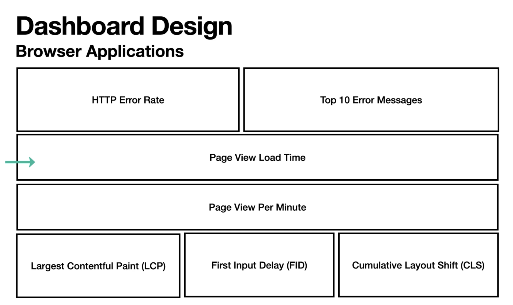

# Grafana

## Dashboard Design

- Create Dash for
  - Browser Apps
  - APM/Backend
  - Infrastructure
  - Synthetic Monitors, (ping website for response, no instrumentation in service)
  - Business
    - Sales
    - Refunds
    - Payments

## Sample Designs by Type 

## Alerting

- Alerts are raised when a defined rule is violated
- Rules are defined as queries & are check by the Alert Manager
- Alerts are sent to Notification Policies
- Notification Policies send notifications to contanct points