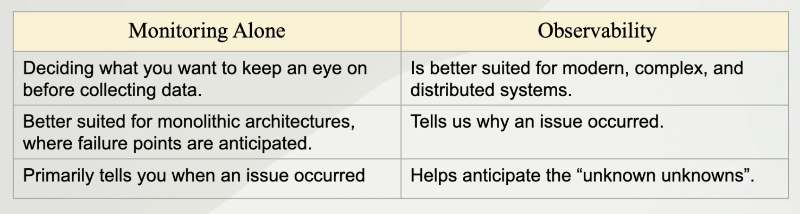

# Foundations

## Monitoring

The collection and visualisation of telemetry so system health can be viewed and tracked. 

Three Questions of monitoring
- Is it on?
  - Does it respond?
- Is it functional?
  - How many errors?
- Is it performing?
  - What is the latency?
  - What is the throughput?
  
Data for monitoring is Telemetry Data, used to determine where a problem might be. 

Metrics used to determine Devops success in monitoring;
- MTTD, mean time to detect
- MTTR, mean time to resolve

## Methods

- RED, Request Oriented
  - Rate, throughput per second
  - Errors, Failed Requests HTTP 500
  - Duration, Latency or Tx response time

- USE, Resource Oriented
  - Utilization
    - CPU, Disc Space
  - Saturation
    - Network Queue Length
  - Errors
    - Disk Write Errors

- Four Golden Signals (from Google)
  - Latency
  - Traffic (Throughput)
  - Errors
  - Saturation (Resources at 100% util)

- Core Web Vitals
  - Largest Contentful Paint(Page Load)
  - First Input Delay (Responsiveness)
  - Cumulative Layout Shift (Stability)

## Observability

Monitoring is part of Observability

To use monitoring we need to know what to monitor in advance. 

Observability is gathering actionable data that gives a holistic view of the entire system and tells us where & why issues occur. 
Observability makes sense of metrics and data collected from various parts of the system. 




## Types of Telemetry collected in Observability system

- MELT
  - Metric
    - An aggregated value representing events over time
  - Event
    - Action occured at specific time
  - Log
    - Detailed Event, lots of info
  - Trace
    - Shows interaction across microservices for given request

## Metric Collection

- Push Model
  - Svcs push metrics to endpoint via TCP, UDP, HTTP
  - e.g. app sends metrics to statsD to be stored in graphite(time series database).

- Scrape Model
  - Svcs provide API for time series database to read metrics
  - e.g. prometheus scraping metrics from http api in app 


# Prometheus Data Model

Prometheus stores data as time series {metric + linux timestamp}
Each time series is identified by metric name and <optional>labels {key+value pair}
```
<metric_name>{key=value, key=value, ...}


auth_api_hit{count=3, time_taken=800}
```

## Prom Data Types

Used when storing data in prom & when retrieved via PromQL

- Scalar (definition: values with magnitude not direction)
  - float
  - string

#### Metric Stored
```bash
prometheus_http_requests_total{code="200", job="prometheus"}
# note, code and job are both of type string
```
#### PromQL Query
```bash
prometheus_http_requests_total{code=~"2.*", job="prometheus"}
# metric_name + label selectors
# =~ regex match operator
```

- Instant Vectors
  - provide a current value for each time series.
  - They are typically used in expressions to get the latest value of metrics.
  - Syntax example: metric_name{label1="value1", label2="value2"} retrieves the current value of metric_name for time series with specified labels.
  - Instant vectors are useful for monitoring and alerting on the current state of your metrics.

#### PromQL Query
```bash
prometheus_http_requests_total{handler="/metrics"}
```

#### Instant Vector Result
```
prometheus_http_requests_total{code="200", handler="/metrics", instance="localhost:9090", job="prometheus-itself"}
764
```

- Range Vectors
    - Select all sample in selected time range, e.g. [5m] - Past 5 minutes
- Supported time units include:
    - s (seconds)
    - m (minutes)
    - h (hours)
    - d (days)
    - w (weeks)
    - y (years, assuming 365 days)

#### PromQL Query
```bash
prometheus_http_requests_total{code=~"2.*", job="prometheus"}[5m]
```

#### Range Vector Result
```
prometheus_http_requests_total{code="200", handler="/metrics", instance="localhost:9090", job="prometheus-itself"}
791 @1719863891.797
792 @1719863896.793
793 @1719863901.794
794 @1719863906.793
795 @1719863911.793
796 @1719863916.798
```

## Arithmetic Ops

PromQL supports arithmetic ops on scalars & instant vectors
```bash
prometheus_http_requests_total + 10
prometheus_http_requests_total{handler="/metrics"} + 10
```

## Comparison Ops
PromQL supports comparison ops on scalars & instant vectors
```bash
prometheus_http_requests_total > 10
prometheus_http_requests_total{handler="/metrics"} > 20
```

## Set Binary Ops

Set binary ops can only be applied on instant vectors
```
                    |   and         or          unless
m{a} 10     m{a} 10 |   m{a} 10     m{a} 10     m{b} 4
m{b} 4      m{c} r  |               m{b} 4
                    |               m{c} 4

prometheus_http_requests_total{handler=~"/m.*"} or prometheus_http_requests_total{code="400"}
```

## Filter Matchers/Selectors

```
, comma seperator is and 
= equal
!= not equal
=~ regex
!~ not match regex

prometheus_http_requests_total{handler="/metrics"}
prometheus_http_requests_total{handler="/metrics", code="200"}
prometheus_http_requests_total{handler="/metrics", code!="200"}
prometheus_http_requests_total{handler=~"/m.*", code="200"}
prometheus_http_requests_total{handler!~"/m.*", code="200"}
```
## Aggregation Operators

- sum
  - sum(prometheus_http_requests_total) by (code)
- min
- max
- avg
- count
  - count of metrics

- group
- count_values
- topk
  - topk(5, prometheus_http_requests_total)
- bottomk
  - bottomk(5, prometheus_http_requests_total)
- stddev
- stdvar

## Time Offsets

Time offset for PromQL goes after metric or range

```
topk(3, prometheus_http_requests_total offset 1m)
topk(3, prometheus_http_requests_total offset 5m)
prometheus_http_requests_total[5m]
prometheus_http_requests_total{handler="/metrics"} [5m] offset 3m
```

## Clamping and Checking Functions

```bash
absent(prometheus_http_requests_total{handler="/metrics"})
# returns empty where query returns results
```

```bash
absent(prometheus_http_requests_total{handler="/non_existent"})
# returns instant vector with 1 element with a value of one
# Used to detect metrics that should exist but do not
```

```bash
absent_over_time(prometheus_http_requests_total{handler="/metrics"}[5m])
# Works like absent except with range vectors
```

- abs
  - converts to absolute values
- ceil
  - rounds to nearest larger integer
- floor
  - rounds to nearest smaller integer
- clamp
- clampmin
- clampmax

## Delta & iDelta

- day_of_week(<instant_vector>)
- day_of_month(<instant_vector>)
- delta(<instant_vector>)
- idelta(<range_vector>)

```bash
delta(prometheus_http_requests_total{handler="/metrics", code="200"}[5m])
```
```bash
{code="200", handler="/metrics", instance="localhost:9090", job="prometheus-itself"}
60.00061017569669
```

## Sorting & Timestamp

- log2(<instant_vector>)
- log10(<instant_vector>)
- ln(<instant_vector>)
- sort(<instant_vector>)
- sort_desc(<instant_vector>))
- timestamp(<instant_vector>)
  - ts of capture

## Aggregation over time

- avg_over_time(<range_vector>)
- sum_over_time(<range_vector>)
- min_over_time(<range_vector>)
- max_over_time(<range_vector>)
- count_over_time(<range_vector>)