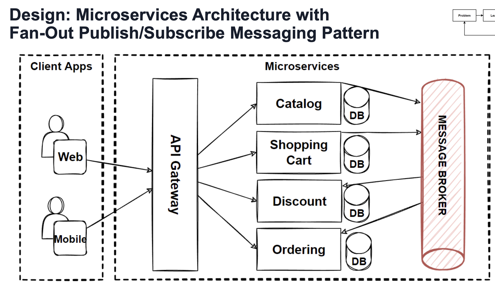

# Microservices async message-based communication

## Problem 

- Long running ops can't handle sync comms
  - http calls to multiple svcs
  - chained queries
  - increased latency 
  - increased coupling between svcs
  - perf, scalability & availability problems

## Best Practices

- Minimise comms between svcs
- Make comms async
  - decouple svc comms

## Solutions

- Async Msg Based Comms
- Working with events

# Sync or Async

## Async

- Client sends request but doesnt wait for response - non blocking
- AMQP (Advanced Message Queing Protocol)
  - Popular choice for async event message passing
  - Using AMQP client sends the message using a message broker system like
    - Kafka 
    - RabbitMQ
- Producer doesn't wait for response
- Subscriber consumes from queue in async way
- For comms across multiple microservices, async messaging is recommended

- AMQP often uses a broker to handle messages sent by producer
  - If consumer is down, possible broker can retry until success
  - Messages can be persisted if required
  - Broker is responsible for delivery
    - Services are decoupled and do not need to be up at same time

We can say sync message chaining between svcs is an anti-pattern. 

## Benefits of Async Comms

- New Subscriber Services
  - Adding new services is simple
  - New Svc can subscribe to particular message queues
  - Producer doesn't need to know anything about consumer
  - Subs can be added and removed without affecting producer
  - Decoupled producer and consumer
- Scalability
  - We can scale producer, consumer & broker independantly 
  - Scale according to load
    - K8s KEDA Auto Scalers
      - According to CPU, RAM, Kafka Message rate
- Event Driven Systems
  - Communicate via event messages
    - Fast data processing
    - Efficient use of resources
- Retry mechanims available via broker config
  - No custom solutions needed

## Challenges of Async Comms

- SPOF
  - Message Broker
  - MB should be scaled
- Debugging
  - It can be difficult to trace messages across services & brokers
  - Use of correlation ID helps
- At-least-once-delivery
- No Gaurantee of order

## Async Message Types

Async Event driven comms give us eventual consistency

- Single receiver msg based comms
  - `1 to 1` or `Point to Point`
- Multi receiver msg based comms
  - `one to many` or `pub/sub`

### Single Reciever Message Based Async Comm - Queue

- This is essentially a 1-to-1 queue
- There is a single producer & single consumer 
- Message remains in queue until consumer takes it

- RabbitMQ etc

### Multiple Reciever - Topic

- Publish/subscribe mechanisms
  - Multiple receivers
  - Publisher knows nothing about reciever
  - one-to-many (topic)
  - pub/sub used in event drivern msvcs
  - msgs are available to all subs
  - msgs remain persistent in a topic until they are deleted
    - retention policy
- Examples
  - Kafka
  - RabbitMQ
  - AWS SNS
  - Eventbridge

Example Event Driven Async Msg Passing
- MSvc publishes an event when something happens
- Price change in a product msvc
  - Shipment and Inventory svcs can subscribe and update their view of the world

## Dependency Inversion Principle

Classes should depend on abstractions instead of concretions

### Fan-out pub/sub pattern

 - A messaging pattern where messages are fanned out to multiple destinations. 
 - Each of destinations can work and process messages in parrallel
 - Pub/Sub model to define a topic which is a logical access point
 - Each svc can scale independantly 
 - Consumer & producers dont need to know where the message comes from or goes to
 - Fan-out pub/sub pattern is used to deliver to multiple svcs

- Pub/Sub is an async comm form
  - Any msg published to a topic is recieved by all subs to the topic
  - Enables event driven arch
    - decouple apps, increase perf, reliability & scalability
- Apps decouple into smaller , independent blocks, easier to dev/debploy & maintain
- Pub/Sub provides instant event notifications
- A message topic provides a light mechanism to broadcast async event notifs
- All components that subscribe to the topic receive every message

### Topic-Queue Chaining & Load Balancing Pattern

### Design

### Adapt

Brokers
- Kafka
- RabbitMQ
- Amazon EventBridge
- Google Pub/Sub

### Evaluate Pub/Sub

- Beenfits
  - New subs very easily added
  - Increased Scaling flexibility
  - Distribute messages at scale
  - Event-Driven Microsvcs
- Drawbacks
  - SPOF - Message Broker
  - Difficult tracing/debuggin
  - Not good for FIFO & Exact-once message delivery

# Problem

- Databases create bottlenecks
  - When scaling microservices with a stateful database
    - It is not easy to scale
  - Vertical Scaling of DBs has it's limits
- Solution
  - Scale Stateful Applications Horizontally 
  - Use service and data partitioning (shards/pods)
  - NoSQL DB to gain easy partitioning features

