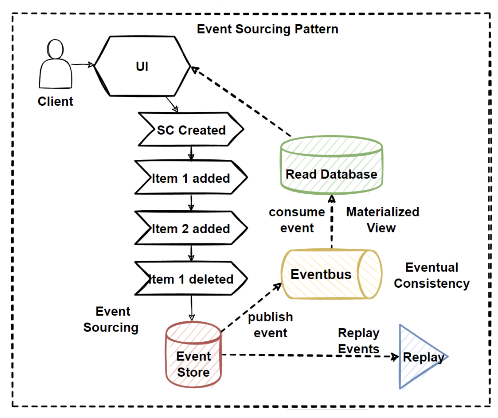

# Commands and Queries

## Problem 

Cross Service Queries and Write Command on Distributed Scaled Databases

- Considerations
  - How to retrieve data from several msvcs?
  - How can we seperate read/write at scale?
- Problems
  - Cross-Service Queries with Complex JOIN ops
  - Read/Write ops at scale
  - Dstributed TX Management
- Solutions
  - Microservices Data Query Pattern 
  - Materialized View Pattern
  - CQRS Pattern
  - Event Sourcing Pattern

# Cross-Service Queries & how to reduce

- Monolith can query many entities easily
  - Strong consistency 
  - ACID compliant
- Microservices use Polyglot persistence
  - We need a strategy to manage queries
- What if clients requests visit multiple svcs

- How to manage cross svc queries?
  - Direct HTTP?
    - Not good, couples microservices. 
  - Async Comms?
    - BP = Reduce inter-svc as much as possible & use async
    - Sometimes not possible
    - Client may need immediate response, Async no good
    - Transient errors, network congestion, svc overload may cause long running queries
  - Materialized View Pattern
    - Reduce inter-service comms and provide sync response. 

## X-Service query solutions

- API Gateway Patterns
  - We can solve X-qeuries applying aggregator pattern 
    - Using an aggregator microsvc
- How can we solve this problem at database level?

- Problems
  - Cross-service queries with complex joins
  - Return sync response with low latency
  - reduce inter-service comms
- Considerations
  - Sync Comms, Svc Aggregator Pattern but increase coupling & latency
  - Async Comms, decoupling svcs, but query requests are waiting for response async
- Solutions
  - Materialized View Pattern
  - CQRS Pattern

# Materialized View Pattern

- Why do we need Materialized View Pattern?
- mostly DB are designed focusing on tables for managing data size & data integrity
- How is the data stored?
  - Instead, how is the data read?
    - This can impact queries, throughput/latency
- Materialized View Pattern is a store containing a denormalized copy of data in the microservices database. 
  - This eliminates the need for cross-service calls. 
  - Reduces coupling and improves reliability, response time
  - Can execute entire op in a single process
- MV could also be called READ model
- Instead of querying services, it maintains it's own local copy of the data

- In summary MV pattern offers to generate pre-populated views of data, more suitable for querying & provide good query performance. 
  - These prepopulated views include joining tables and combining data entities & calculated cols & data transforms
  - Views are disposable and re-built from sources

- Drawbacks
  - Duplicated data
    - However for strategic reasons
    - Only one svc can own data
    - How will our denormalized view be updated?
    - When the original source is updated, so too should the MV be updated
      - We solve this with async messaging & pub/sub pattern
      - Publish an event when data changes, subscribers listen to updated their MV or denomalised table. 
      - Possible to use scheduled task, external triggers or manual action to update MV

# CQRS

## Command Query Responsibility Segregation Patter

- CQRS is used to avoid complex queries and get rid of inefficient joins
- Seperates read & write ops by seperating them into databases for read & write
  - Commands: Changing State of data in app
  - Queries: Handling complex join ops, fetching data, no data change
- Large Scaled Microservice Arch needs to manage high-volume data req's
- Single database for services can cause bottlenecks
- Using both CQRS & Eventual Consistency, can improve app performance. 
- CQRS, offers sererating read & write of data to allow for scaling read & write independently

- Monolith has a single db, performing complex join queries & CRUD ops
  - This can become un-manageable as load increases
  - When the app needs to do a tx across 10 tables, all are locked & latency goes up. 
  - Splitting Reading & Writing to DB we can have multiple strategies
    - e.g. RDBMS for write, NoSQL for read
  - SoC , Seperation of Concerns Principle
- General approach 
  - READ DB, uses NoSQL with denormalised data
  - WRITE DB, uses RDBMS with fully normalised data, with strong consistency

- App mostly reading is a read-incentive application
- Read & Write are asymmetrical with different perf & scale req's
- To improve query performance the read operation performs queries from a denomalized materialized view to avoid expensive joins & locks
- Write Ops or Command, perform commands into normaly RDBMS
  - Supporting ACID Tx & Strong data consistency 
- Commands can be handled with a message broker system to process cmds async
- Queries never modify, always return JSON obect with DTO objects. 

### Benefits & Drawbacks of CQRS

- Benefits
  - Scalability
    - READ & WRITE DBs can be scaled independently
    - READ DB follows denormalized data to perform complex join queries
    - If application is read-incentive app, we can scale read database more than write db
  - Query Performance
    - READ DB contains denormalized data that reduce to complex & long running join queries. Complex logic goes into write db.
  - Maintainability & Flexibility
    - READ & Write changes to logic & schema may not directly affect one another. 
- Drawbacks
  - Complexity, added
  - Eventual Consistency
    - WRITE data may not be reflected in READ data
  - If we need strong consistency CQRS is not an option

## Event Sourcing

- Apps typically save latest state of data in a DB
- In large scale, apps with a lot of updates can lead to poor db performance, reponsiveness & scale limits
- Event Sourcing pattern offers to persist each action that affects data to an Event Store DB. Where each action is an event. 
- Instead of saving latest state, we have a list of sequentially events. 
- Instead of updating data, we insert new event in Event Store. 
- Each insert to event store, should also create an event on an event bus. 
- The events on the event bus can be consumed by apps to create materialized views of their own. 
- Event Store is the Source of Truth in the system. 
- We also now have ability to REPLAY events. 

## CQRS with Event Sourcing

CQRS and Event Sourcing combined for best performance and eventual consistency

## Eventual Consistency Principle

- Eventual Consistency is used for systems that prefer high availability over strong consistency 
- System will be consistent eventually 
- Consistency 
  - Strict
    - Saved data is reflected for all clients
  - Eventual
    - It will take some time to be seen for all clients
  
- CQRS with Event Sourcing Patterns
  - User actions become events in Event Store
  - Data will get to the Reading database via message brokers, or pub/sub
  - Data will be denormalized into materialized view database for querying 

- CAP 
  - Choose C or P in an Available system
