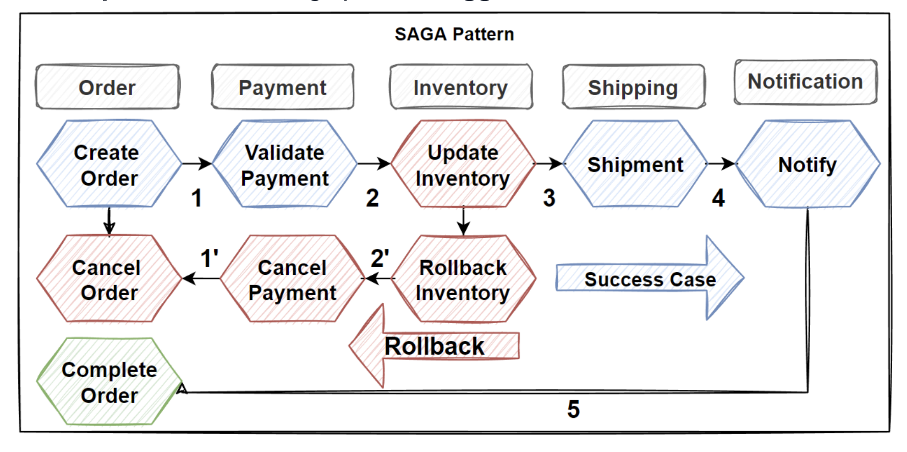
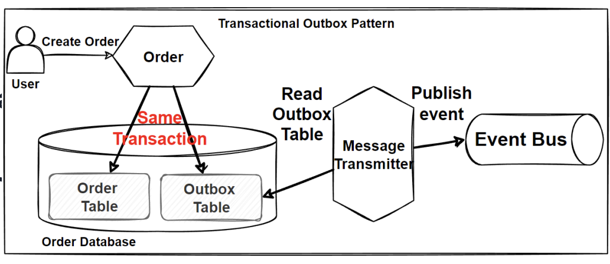

# Microservices Distributed Transactions

### Problem: Consistency across msvcs in distributed txs

- Considerations
  - How to perform tx across multiple msvcs?
  - Consistency across multiple msvcs?
  - Rollback tx & run compensating steps?
- Problems
  - Distributed Tx Management
  - Rollback Tx on Distributed Environment
  - Compensate steps upon a service failure
- Solutions
  - Best Practices
  - SAGA Pattern for distributed txs
  - Tx Outbox Pattern
  - Compensating Tx Pattern
  - CDC: Change Capture Data

## Tx Fundamentals & ACID principles

- Tx is the context of db ops that should act as a single unit of work
- Tx should fully complete or rollback if any part fails, remaining consistent
- ACID
  - Atomicity
    - All ops completed in tx or all rolled back
  - Consistency
    - Data in db is kept in valid state after any operations
  - Isolation
    - Seperated txs running concurrently cannot interfere with one another
  - Durability
    - After tx is committed, it is stored durably
- RDBMS provide ACID gaurantees to ensure strong consistency

### Transaction Management in Monolithic Architecture
- **Easy Management**: Transaction management in monolithic architecture is straightforward compared to microservices.
- **Single Database**: Mechanisms operate with a single database for the entire application.
- **Context**: Developed for scenarios where all transactions occur within a single context.
- **Operations**: Commit and rollback operations are simple.
- **In-Memory Transactions**: Transactions within the transaction scope are kept in memory until committed or rolled back.
- **Commit Operation**: Completes the transaction successfully when written to the database.

### Microservices Distributed Transactions
- **Complexity**: Performing transactional operations across microservices is more challenging.
- **Querying Data**: Running complex join queries across microservices is difficult.
- **Manual Implementation**: Distributed transaction management in microservices often requires manual implementation.
- **Eventual Consistency**: Microservices often operate with eventual consistency.
- **Database Structure**: Each microservice has its own database, making data consistency across services harder to achieve.
- **Consistency Goals**: Achieving consistency across multiple microservices requires careful design and implementation.

### Data Consistency Across Multiple Microservices
- **CAP Theorem**: Balancing ACID strong consistency with high availability and partition tolerance.
- **Microservice Approach**: Sacrificing strong consistency for eventual consistency to prioritize availability and scalability.
- **Database Choice**: NoSQL databases are commonly used due to their horizontal scalability in distributed environments.
- **Communication**: Asynchronous event-driven communication and publish/subscribe patterns support eventual consistency.
- **Example**: Product updates triggering events published to an Event Bus, subscribed to by other services.
- **Resilience**: Processes should be resilient and idempotent for redundant event processing.

### Bounded Context Pattern (Domain-Driven Design)
- **Strategic DDD**: Defining large-scale models and business rules for loosely coupling units.
- **Tactical DDD**: Focuses on implementation with design patterns like entity, aggregate, value object, etc.
- **Ubiquitous Language**: Common language within a domain, dividing boundaries into bounded contexts.
- **Complex Domains**: Complex domains are broken down into smaller, more manageable parts.
- **Subdomains**: Some subdomains can be combined and grouped for common rules and responsibilities.

### Identify Bounded Context Boundaries for Each Microservice
- **Domain Expertise**: Consulting domain experts to identify bounded contexts.
- **Iterative Design**: Bounded contexts are not immutable; they should be reshaped iteratively.
- **Refactoring**: Consider refactoring bounded contexts with changing conditions.
- **Expert Consultation**: Discussing with domain experts helps in defining domains and subdomains.
- **Microservices Evaluation**: Expert evaluation aids in identifying microservices.
- **Subdomains**: Represent same data but named differently due to expertise areas of domain experts.
- **Collaboration**: Consulting several domain experts for their expertise areas is crucial.

## SAGA Pattern

- SAGA pattern is an approach to manage data consistency across microservices in a distributed transaction use case
- SAGA offers to create a set of transactions that update microservices equentially & publish events to trigger the next transaction in the next microservice. 
- If a step fails, then SAGA aims to trigger a rollback of transactions, doing reverse operations and publishing rollback events to microservices in previous steps of the transaction. 
- This can be achieved using pub/sub pattern or API composition
- SAGA pattern can manage long-running txs involving multiple services
- Usefull where multiple svcs must coordinate their actions
- Ensure the overall tx is either completed successfully, or rolled back to initial state. (compensating transaction)

## Choreography based SAGA pattern

Choreography SAGA pattern achieves tx & rollback via event bus & pub/sub pattern

- Benefits
  - Decentralized & flexible, event based approach, ez to implement
  - Decouple direct dependency of microservices when managing txs
  - Avoid SPOF, no orchestrator, events via pub/sub
  - Simple workflows
    - SAGA works well for simple workflows without much tx steps
- Drawbacks
  - More complex to manage
  - Confusing to add more steps
  - Cyclic Event Consume Risk
  - May or may not be suitable option for specific systems

## Orchestration based SAGA pattern

Orchestration SAGA uses a centrlized Orchestrator service to manage failures and rollback with compensating tx. 

- Benefits
  - Clear, Central point of control to manage tx
  - Easier to understand and debug system & add new tx or modify existing flow
- Drawbacks
  - Orchestrator is SPOF
  - Orchestrator can become a bottleneck
- Result
  - Can be useful, consider tradeoffs. Scaling Vs Ease of implementation
  - Orchestration good for complex workflows which include lots of steps. 
  - Steps may become complex

## Compensating Transaction Pattern

Compensating Tx pattern is a rollback process of SAGA

- Aims to reverse the steps of a previsouly executed tx. 
- In a SAGA tx, if any part fails, the effects of the tx need to be undone
  - The steps of the original tx should be undone
- Compensating tx is also eventually consistent and could fail
- The system should resume the compensating tx at the point of failure & continue
- The steps in a compensating tx should be defined as **idempotent comments**

## Dual Write Problem

- **Definition**: The dual write problem refers to the challenge of synchronizing data across two separate systems, often leading to inconsistencies.
- **Scenario**: When data needs to be written simultaneously to two different databases or systems, such as a primary and a backup.
- **Issues**:
  - **Data Inconsistency**: Synchronization delays or failures can result in inconsistent data between the systems.
  - **Complexity**: Managing simultaneous writes adds complexity to the system architecture and increases the risk of errors.
- **Solutions**:
  - **Transaction Management**: Implementing transactional operations to ensure atomicity across both writes.
  - **Change Data Capture (CDC)**: Using CDC mechanisms to capture changes in one system and replicate them to the other.
- **Challenges**:
  - **Latency**: Synchronization delays can occur due to network latency or system load.
  - **Conflict Resolution**: Resolving conflicts that arise when updates occur on both systems before synchronization.
- **Best Practices**:
  - **Idempotent Operations**: Designing operations to be idempotent to handle duplicate writes without unintended side effects.
  - **Monitoring and Alerts**: Implementing robust monitoring and alerting systems to detect synchronization failures promptly.

- Monolith
  - Split the commit tx into 2 steps & ensure ACID gaurantees for both 
  - Requires 2 phase commit
  - Requires locks and won't scale well. 
- Solutions
  - Transactional Outbox Pattern 
  - CDC - Change Data Capture
- Best Practice
  - Kafka and CDC using debezium in event driver apps
  - Cockroach DB which has in-built CDC

## Transactional Outbox Pattern

Aiming to publish events reliably

- Idea is to have an Outbox table in the microservices database
- Solves Dual Write problem
  - Where consistency can be a problem when a leg of dual write fails
- Instead of sending data to 2 seperate locations, send a single tx that stores 2 seperate copues of the data in the db
- One in relevant db and another is a copy in an outbox table that will publish to an event bus. 
- Msvcs don't directly send updates to eventbus, instead messages are persissted in outbox
- After that a job publishes events from outbox to message broker at intervals

- Why use Tx Outbox?
  - When working with critical data that must be consistent
  - When DB update & sending message should be atomic

## Problem - Listening/polling outbox table

Creates another dual write problem.It may read from outbox and fail to publish to event bus

## CDC, Change Data Capture

A technology that captures insert, update & delete activity in a database, then propagating those changes. 

 - Example
   - Debezium connector
   - Cockroach DB Change Feed
   - Azure Cosmos Change Feed

## Problem - Handling Millions of Events across microservices

SAGA, TX Outbox & CDC

- Benefits
  - Maintain the integrity of your database
  transactions
  - Real-time synchronization
  - Extracting and propagating changes to be kept
  up-to-date with the data
  - Decouple data and propagate events
  - Easier to scale and maintain a microservices
- Drawbacks
  - Increased Complexity, Outbox Pattern and CDC
  makes your system more complex design.
  - Add latency to the event publishing process
  - Performance burden on the database
  - Difficult to set up and maintain

- Considerations
  - What if we have thousands of microservices that need to
  communicates with millions of events ?
  - If multiple subsystems must process the same events
  - Required Real-time processing with minimum latency.
  - Required complex event processing, like pattern matching
  - Required process high volume and high velocity of data,
  i.e. IoT apps.
- Problems
  - Decoupled communications for thousands of
  microservices
  - Real-time processing
  - Handle High volume events
  Solutions
  - Event-driven architecture for microservices

