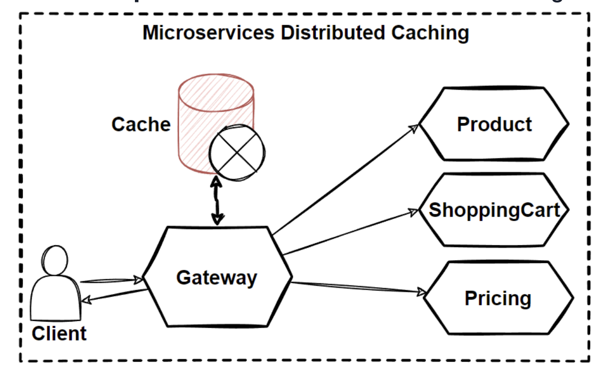

# Microservices Distributed Caching

- Patterns and Practices
  - Cache-aside
  - Cache strategies
  - Cache invalidation
  - Cache consistency

## What is caching ?

- A technique to improve performance by storing frequently accessed data in a cache that can be quickly accessed from memory
- Reduce expensive requests to network or db
- Increase perf, scalability, availability & reduce latency
- Caching can handle higher number of requests with high avilability
- If app requests mostly read data, caching can be very efficient
- Caching can also avoid re-calculation of things like catalogue product search for example

## Types of caching

- In-memory cache
  - Stores data in main memory, typically volatile
- Disk cache 
  - Slower than memory cache, but durable
- Distributed Cache
  - Spread across multiple machines, typically used in microservice architectures
  - Can be accessed from multiple locations

## Distributed Caching

- Storing data in a cache that can be accessed from multiple locations
  - Improve perf
  - Reduce need to call external systems
  - Improve resilience
    - Continue working with cached data when downstream is offline
  - Scalability

## Cache Hit & Miss

- Hit
  - When data is found in cache
- Miss
  - When data is not in cache and must be retrieved elsewhere
- Cache Hit are desirable
  - Reducing load on downstream
- Cache misses can have negative impact on performance
  - Requiring additional time to fetch data
- The cache hit rate is a measure of how often a cache is able to fulfill requests from cache store
  - High rate, incidactes cache is effective
  - Low rate, may indicate the cache is not large enough

## Cache Strategies

- Strategies
  - Cache Aside
    - App checks cache for data, if not found queries db, places data in cache. 
    - Data is lazy loaded into the cache
  - Read-Through
    - When data is not found in the cache, the cache will automatically retrieve the data from db, store in cache and return data to caller. 
    - (In cache aside, the client is responsible for storing data in cache)
  - Write-Through
    - Updates cache whenever the data behind is updated
    - Pro-actively updated as opposed to lazy loaded
    - Can result in higher number of ops
  - Write-Back, Write-Behind
    - Similar to write-through, but waits until later time to update cache
    - Cache may not be up to date

## Cache Aside Pattern for Microservices

- Most common caching strategy
- Redis, or memcached

- Drawbacks of cache-aside
  - Additional complexity
  - Cache needs invalidation when db is updated, may require co-ordination
  - Potential additional latency
  - Cost $ - cloud providers 
  - Cache Stampede!
    - If cache becomes of expires, all data may be requested very quickly

