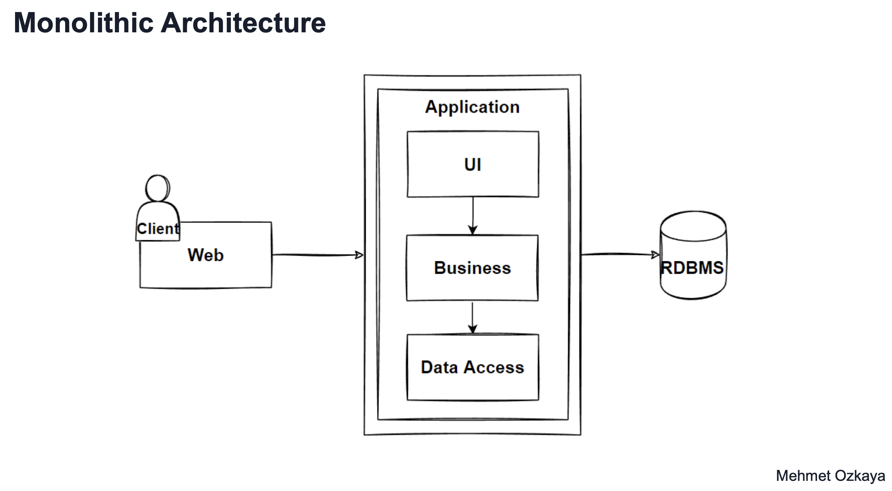

# Monolithic Architecture

Let's look at;
- When to use
- Benefits
- Challenges
- Pros-Cons
- Reference Architectures

## What ?

 - Traditional approach
 - Develop the complete app as a single unit
 - Tightly coupled components
 - Single Codebase
 - Single deploment file - Jar/War
 - Valid for some scenearios

## Advantages
 - Easy to start and debug

## Disadvantages
 - Difficult to manage, too large in time
 - Difficult to implement new features, difficult for many devs, spaghettified code

# When to use monolith

- Small applications
  - Straightforward
    - Build
    - Test
    - Deploy
    - Debug
    - Scale Vertically - Bigger memory/disks/cpu etc
- Small team, founding stage
- Simple app with predictable scale and complexity
- Making a POC, neededing quick launch. 
- No Microservice Expertise req'd
  
# Benefits
 - Simple dev/deploy/debug/test
  
# Challenges
 - Complex & Large over time
   - Difficult to understand, at some point nobody understands it
 - Hard to change
   - Tightly couples components, difficult to seperate
 - Barrier to new technology
   - Interlocking dependancies make it difficult to seperate components and integrate new things
 - Only option to scale is vertically
 - Availability
   - Bugs or outages can take out the whole system

# Design Principles

## DRY

Don't repeat yourself
- Try not to duplicate code or services needlessly 

## KISS

Kiss it simple stupid
- Avoid unnesssecary complexity
  - Simple code is easier to maintain and understand

## YAGNI

You aren't gonna need it
 - Try not to add extra features that you might need in future
 - Do the simplest thing that will work

# Design an e-commerce application

# Before Design

First, always try to identify Functional & Non-Functional requirements.

## Functional Req's

 - List Products
 - Filter Products by Category & Brand
 - Put Products in Cart
 - Apply Coupons
 - Checkout
 - List Orders

## Non Functional Req's

 - Availability
 - Small Number of Concurrent Users

# Evaluate Monolith Approach

## Problems

 - Complex over time
 - Hard to understand
 - So much code needs organization
  
## Solutions

 - Seperate UI, Logic, Data layers as logical layers
 - Use Layered Architecture
 - SOLID Design