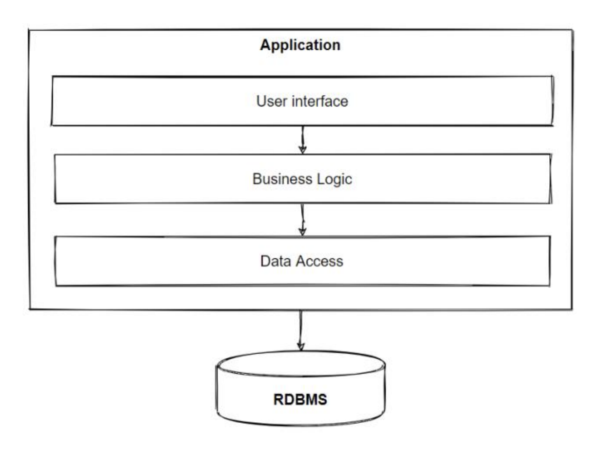
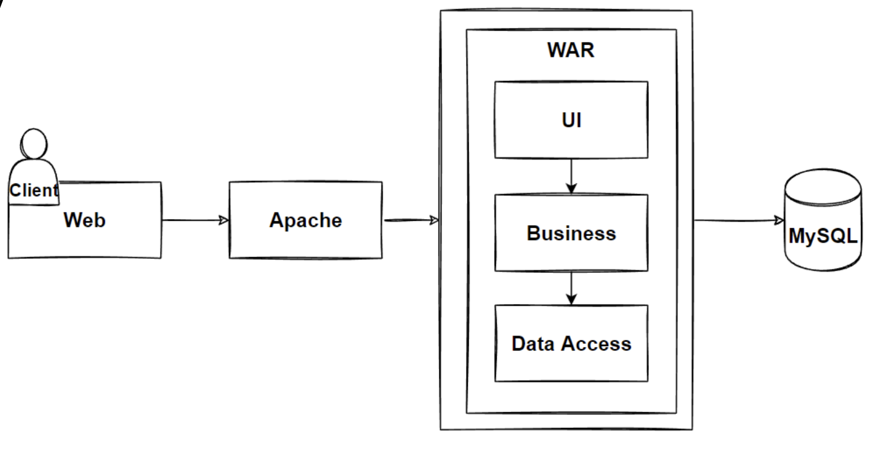

# Layered Architecture

 - Still a monolithic architecture 
   - however now seperated into logical layers
   - components are connected, but do not depend on each other
   - In Essence: Code organized using `seperation of concerns`
   - Isolation between layers
     - Layers can be changed without affecting others

# Components

 - Presentation Layer
   - UI 
   - Web interface
   - Mobile App
 - App/Business Layer
   - Logic to accomplish functional requirements & use cases
 - Database Layer
   - Handling data, databases, storage
  
# Design Principles

## Seperation of concerns(SOC)

 - Core design principle
 - Seperate program into distinct sections addressing seperate concerns
 - Isolate layers so there is little overlap, managing complexity
 - Distinguish between concepts
   - Elements in the software should be unique
   - Low Coupling
     - The degree of interdependance of modules, should be low
     - Modules have little knowledge of other modules
   - High Cohesion
     - The degree to which components of a single module relate to that specific module
  
## SOLID

- Single Responsibility
  - Each component has only one function
- Open-Close
  - Components should be extendable but not modifiable
- Liskov Substitution Principle
  - Objects of a superclass should be replacable with objects of a subclass without breaking the application.
- Interface Segregation
  - Code should not be forced to depend on interfaces it does not use
- Dependancy Inversion
  - Classes should depend upon abstractions like interfaces instead of concrete implementations

# Design

## Functional Req's

 - List Products
 - Filter Products by Category & Brand
 - Put Products in Cart
 - Apply Coupons
 - Checkout
 - List Orders

## Non Functional Req's

 - Availability
 - Small Number of Concurrent Users
 - **Maintainability**
  
## Architectures

- Monolith
- **Monolith Layered**

# Evaluate

- Benefits
  - Easy Development, Debug & Deploy
  - Horizontal Logical Layers
  - SoC
- Drawbacks
  - Layers depend on one another
  - Hard to maintain
  - Complex codebase
  - Hard to change libraries

## Problem

The layered architecure has highly coupled layers
- Code organization is a challenge
- Frameworks/Libs become locked in

## Solution 

Use Clean Architecure Pattern