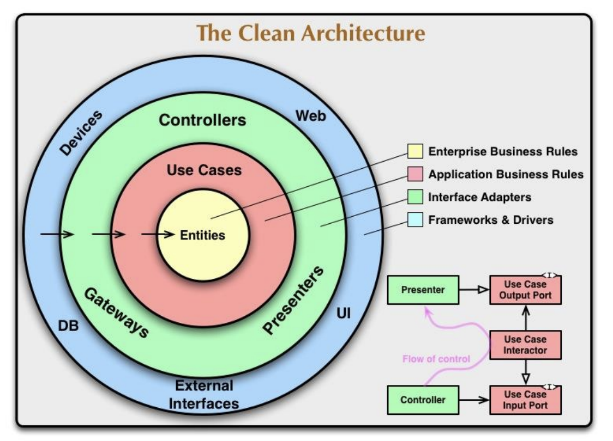

# Clean Architecture

Still a Monolithic Architecture

- Benefits & Challenges
- Dependanct Rule
- Re-design our e-commerce app with Clean Arch

## New Non-Functional Req's

Layered Architecture - Maintainability  
Clean Architecture - Flexibility, Testability

- The outer circles are mechanisms.  
- The inner circles are policies.

# Benefits

 - Software is Independant of DB & Framework - change easily
 - Independance of UI
 - Testable
   - Business rules shouldn't know anything about outside world
     - Achieved via dependancy inversion and interfaces!

# Design

## Functional Req's

 - List Products
 - Filter Products by Category & Brand
 - Put Products in Cart
 - Apply Coupons
 - Checkout
 - List Orders

## Non Functional Req's

 - Availability
 - Small Number of Concurrent Users
 - Maintainability
 - **Flexibility**
   - Low resitance to change
 - **Testability**
   - Ease of testing components
  
## Architectures

- Monolith
- Monolith Layered
- **Monolithic Clean Architecture**

# Patterns and Principles 

The Dependency Rule
 - This rule says that source code dependencies can only point inwards
 - Nothing in an inner circle can know anything at all about something in an outer circle.

# Evaluate 

Benefits
- Easy Development/debug/deploy
- Loosely coupled layers
- flexible logical layers
- testable

Drawbacks
- layers are independant, but those are still in a single app
- Vertical business logic requires modification of all layers
- It is still monolithic, so has scaling issues
  - Can only be scaled vertically (bigger cpu/ram/disk)

Problems
- As business grows and more users create more req's per sec
  - How can we provide better latency as server becomes overwhelmed?

Solutions
- Scaling
  - Vertical & Horizontal
  - Up & out
  - Load Balancing
