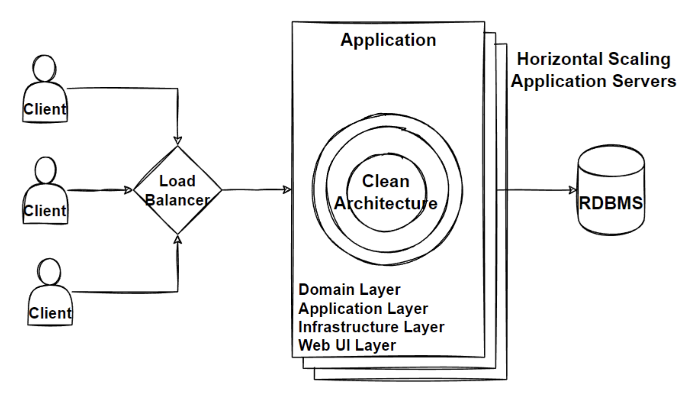

# Scaling

- Vertical and Horizontal Scaling
- Calc how many concurrent requests our design can handle
- LB with consistent hashing

- Problems
  - increased customers, increased load
- Solutions
  - Scalabity
  - Vertical & Horizontal Scaling
  - Scale up & out
  - Load Balance

# Scalability

Measured by # of requests handled in time
To prevent downtime & reduce latency we must scale

- Horizontal
  - Add more machines
- Vertical
  - Add more resources to a machine

## Vertical - Scaling Up

- Existing code doesnt need to change
- Add CPU, RAM, DISK
- Scaling up has limitations
  - Cannot infinitely add resources
- For millions of requests we need horizontal scaling

## Horizontal - Scaling Out

- Essentially adding more instances of machines
- Distributing the load accross these machines
- Gives scalability & also reliability
  - More machines, more redundancy
- Prefferred way to scale in distributed architectures
- When splitting, consider if we have State or not
  - No state makes it easy to scale horizontally
  - If we have state we may be limited by CAP theorom

## Load Balancer

 - Balance Traffic across nodes of app
 - Spread traffic across multiple clusters of servers to improve
   - Responsiveness & Availability
 - LB sits between client & server
 - Distributing traffic using different algos
   - Consistent hashing
     - Useful for machine failures
   - Round Robin
 - LBs should be faults tolerant & improves availability

# Design

## Functional Req's

 - List Products
 - Filter Products by Category & Brand
 - Put Products in Cart
 - Apply Coupons
 - Checkout
 - List Orders

## Non Functional Req's

 - Availability
 - Small Number of Concurrent Users
 - Maintainability
 - Flexibility
   - Low resitance to change
 - Testability
   - Ease of testing components
 - **High Concurrent Users**
 - **Scalability**
 - **Reliability**
  
## Architectures

- Monolith
- Monolith Layered
- Monolithic Clean Architecture

## Patterns & Principles

- Horizontal Scaling
- LB

# New Design

- Client requests are routed through a load balancer and distributed to multiple instances of the monolithic application. 
- If requests require state specific to user we need alternative techniques  

- Load Balancer
  - NGINX
  - Apache LB

# Evaluate 

Evaluate this clean, horizontally scaled architecture. 

- Benefits
  - Easy develop/debug/deploy/test
  - Loosely coupled layers
  - flexible logical layers
- Drawbacks
  - Layers independant but they are still single app
  - A vertical slice in this arch may touch all layers
    - Changing UI, adding fields to models, etc
  - layers in vertical slice are highly coupled

- Problem
  - Difficulty adding New features 
  - Difficulty working for multiple teams
- Solution
  - Modular Monolithic Architecture