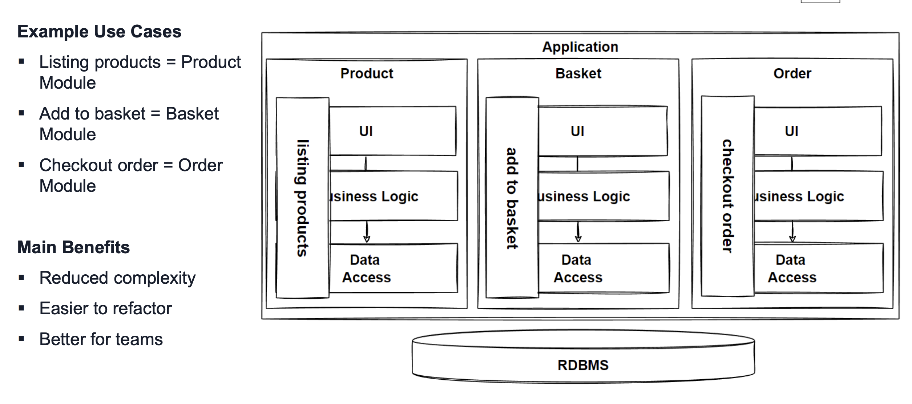

# Modular Monolithic Architecture

Evolution on the way to Microservices

 - Problems
   - Business has many teams
   - Teams all want new features
     - Extreme difficulties with many people and teams adding to and deploying app

Modular Monolithic architecture divides each module into independant and isolated segments. Each should have its own business logic and database.

Vertical slices can be updated scoped into logical slices, but still the whole app is deployed as one. 

## Benefits

- Business Logic encapsulated in modules, highly re-usable
- Re-usable code, easier to refactor
- Better Dependancy organization
- Less Complex than microservices architecure
  - Easier to manage modules in a single place, over many microservices

## Challenges

- Polyglot technology stack not possible
- Cannot scale and deploy independantly

## When to use Modular Monolithic Arch

- Strict Data Consistency Cases
  - For example, in a banking system where a transaction fails, some other accounts may need to roll back immediately.
    - In a distributed arch. This would require some latency. 
- Modernization
  - If you already have a complex monolith, slow refactoring into modules, can lead you to a place where modules are ready to become libraries and microservices. 
- Instead of jumping straight to microservices, which is potentially a big impact on the busines. We can get some benefits through modularization. 
- Green field project
  - A modular monolith allows you to learn the business domain and pivot arch faster than microservices. You don't have to worry about deployment pipelines and management and monitoring of many services. Simple deployment topology. 

## Monolith First Approaches

Martin Fowler says successful microserves arch start with monolith. 
- Microservices incur significant complexity
- YAGNI principle
- Microservices work well when you have stable boundaries between services

Sam Newman agrees with MF above
- Start with a single unit monolith
- Leverage microservices only if you become convinced of the benefits for your system.. 
- Monlith is a valid choice
- If you follow modular monolithic architecture
  - Re-usability
  - Easy to Refactor
  - Possible to extract & scale pieces
- If strong consistency is req'd and independant scale is not
  - Start with modular monolithic arch
- If Strong concistency is not req'd and eventual consistency is okay and independant scale and deploy is req'd
  - Use microservices
  
# Monlithic Vertical Considerations

- Decomposition
- Comms
- Data Management
- Transaction Management
- Deployment
- Resilience

# Communication between modules

- Method Calls
  - Fast
- Service Bus
  - Kafka

# Transaction Management

 - Modular Monolith tx easier than microservice
 - We can commit and rollback operations in a monolith arch
   - Transactions
- Txs in tx scope are kept in memory without writing to db until they are committed & if rollback is made any time, all txs in scope are deleted and tx is cancelled. 

# Deployments of Modular Monolith

- Single code base, so its difficult to manage
- Many teams write to same repo
- Deploy via single pipeline
- Single deployment in production
  - One bug can bring down whole app

# Design

## Functional Req's

 - List Products
 - Filter Products by Category & Brand
 - Put Products in Cart
 - Apply Coupons
 - Checkout
 - List Orders

## Non Functional Req's

 - Availability
 - Small Number of Concurrent Users
 - Maintainability
 - Flexibility
   - Low resitance to change
 - Testability
   - Ease of testing components
 - High Concurrent Users
 - Scalability
 - **Reliability**
 - **Re-usability**
  
## Architectures

- Monolith
- Monolith Layered
- Monolithic Clean Architecture
- **Modular Monolithic Architecture**

## Patterns & Principles

- KISS, YAGNI
- SoC
- SOLIC
- Dependancy Rule
- Horizontal Scaling
- LB
- **Monolithic First Strategy**

## Benefits 

Easier dev/debug/deploy

## Drawbacks

 - UI ops handled in monolith
 - Complexity of UI will become complex
 - UI Layer generated server side, every page trying to compete for compute
 - Small UI changes in each use case or feature require full redeploy

# Problem

 - We now have requirement for improved performance between web,mobile, support, admin UIs
- Development of new pages/features
- SPA to improves responsiveness

# Headless Architecture / Seperated Presentation Layers

- Headless architecture seperates the frontend and backend layer of the application
  - Seperating the UI from the Business Logic
  - Use APIs to connect the front and back end
  - SPA apps are contained in a single web page without requiring reload & able to update page in a responsive way. 

## Benefits

- Flexible
  - Use multiple technologies for UI
- Update FE independantly of BE
- Innovate and experiment easier
- Better performance

- LB
  - Apache LB
  - NGINX
- FE SPAs
  - Angular
  - Vue
  - React
- BE
  - Single JAR/WAR
- DB
  - Oracle
  - Postgres
  - SQL Server

# Evaluate Headless

- Benefits
  - Easy dev/debug/deploy
  - Encapsulate Business Logic in BE
  - Reusable code, easy refactor
  - Better organized for multi teams
  - Update UI alone
- Drawbacks
  - Scalability limits, DB cannot be scaled
    - Million requests would cause timeouts 
  - Still monolithic (scale and deploy coupling)
    - can't scale modules
    - can't deploy modules alone

# Next Problem

 - Scale and deploy independantly 
   - Flexible scaling of parts to meet peak times
 - New feature time to market slow due to deployment coupling
 - Innovation interferes with other teams

# Solution

Moving to microservices architecture. 