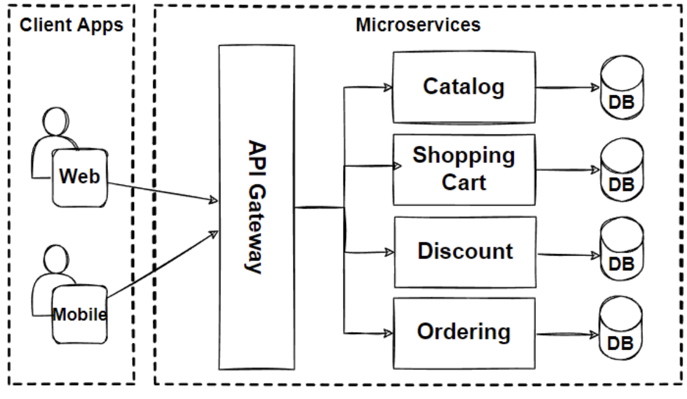
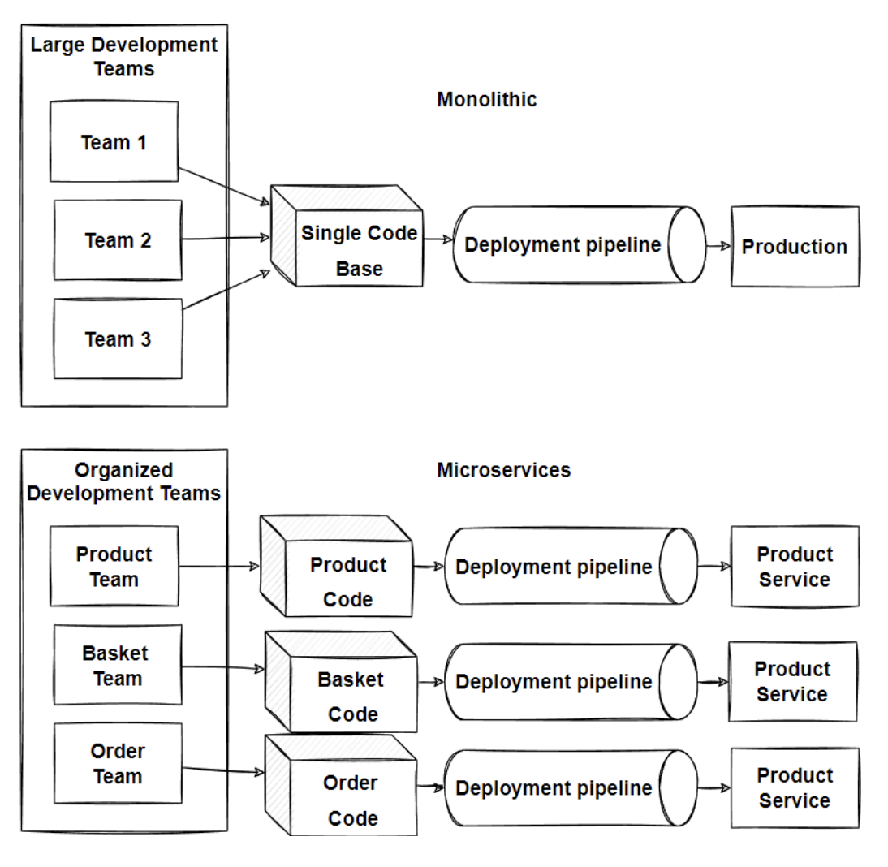
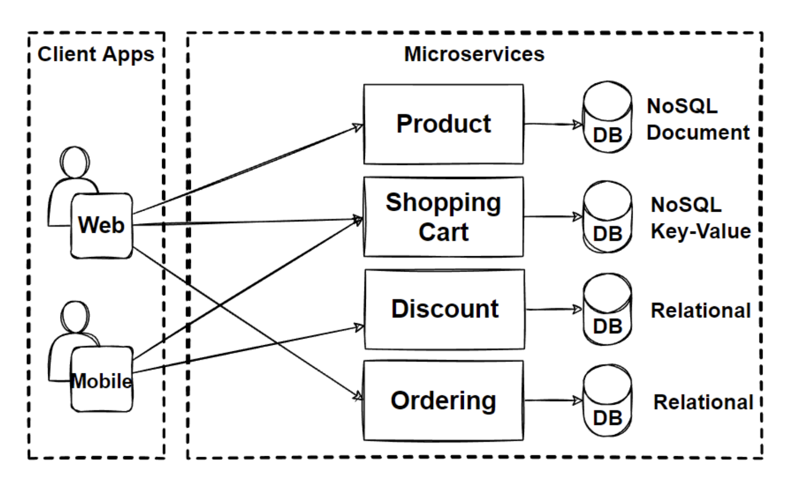

# Microservices

- Small independant loosely couples services
- Each service, one codebase
- MicroServices communicate via APIs
- Can be deployed independantly and autonomously
- Microservices can have different tech/frameworks
- Each MS has its own DB, not shared with another. 

Martin Fowler
- MS is a srtle to dev a single app as a suite of small services
- Each running own process and comms via lightweight mechanisms
  - HTTP, gRPC, GraphQL
- Built around business capabilities
- Owned by small, self contained teams
- Fits within a bounded context

# Characteristics

- Componentization via Services
- Organised around business capabilities
- Products not Projects
- Smart endpoints and dumb pipes
  - Endpoints(Apps/Services) can be complicated
  - Pipes(Message passing) should be simple
- Decentralized Governance
  - Empowers teams to choose their own tech 
- Decentralized Data Management
  - Empowers teams to choose their own models, schema, api, etc
- Infrastructure automation
  - develop/test/deploy
- Design for failure

# Benefits

- Agility, Innovation, and Time-to-market
  - Microservices enable rapid development and innovation, accelerating time-to-market for new features.
- Flexible Scalability
  - Microservices allow independent scaling, enabling efficient resource allocation by scaling out specific services rather than the entire application.
- Small, Focused Teams
  - Microservices facilitate small feature teams to build, test, and deploy services independently.
- Small and Separated Code Base
  - Microservices have minimal dependencies, as they do not share code or data stores with other services. This separation simplifies adding new features.
- Easy Deployment
  - Microservices support continuous integration and continuous delivery, allowing for quick experimentation and easy rollback if necessary.
- Technology Agnostic
  - Right Tool for the Job: Small teams can choose the technology stack that best suits each microservice, enabling flexibility and leveraging the right tools for specific tasks.
- Resilience and Fault Isolation
  - Microservices are fault-tolerant and implement resilience patterns such as retry and circuit breaking, ensuring robustness in the face of failures.
- Data Isolation
  - Microservices maintain separate databases, facilitating easier schema updates as changes only affect a single database, enhancing data isolation and management.

# Challenges

- Complexity: Microservices introduce complexity due to the increased number of services. Managing deployments and communications becomes challenging with numerous microservices.
- Network Problems and Latency: Inter-service communication in microservices architecture requires handling network issues and latency. Chains of services can exacerbate latency and lead to chatty API calls.
- Development and Testing: Developing and testing end-to-end processes in microservices architectures is more challenging compared to monolithic ones due to the distributed nature of the system.
- Data Integrity: Each microservice has its own data persistence, leading to challenges in maintaining data consistency. Eventual consistency is often followed to address this challenge.
- Deployment: Deployments in microservices architectures require significant investment in DevOps automation processes and tools. The complexity of managing multiple microservices can be overwhelming for manual deployment.
- Logging & Monitoring: Distributed systems necessitate centralized logging to aggregate logs for monitoring and troubleshooting. A centralized view of the system helps identify sources of problems.
- Debugging: Debugging across multiple microservices is challenging as debugging through a local IDE is not feasible across dozens or hundreds of services. Alternative debugging strategies are required.

# When to use Microservices

- Ensure Clear Justification 
  - Before implementing microservices, ensure a strong rationale. Microservices are beneficial for applications requiring agility, zero-downtime deployments, and independent updates.
- Start with Monolithic-First Approach
  - Begin with a single-process monolithic application. Sam Newman and Martin Fowler advocate for iterating and refactoring gradually, converting modules into microservices one at a time.
- Enable Independent Deployments
  - Microservices are suitable for organizations needing to deploy new functionality independently without affecting the entire system.
- Facilitate Independent Scaling
  - Microservices allow for independent scaling of specific application components, providing flexibility and efficiency.
- Utilize Different Database Technologies for Data Partitioning
  - Microservices excel in scenarios where data needs to be partitioned and scaled with different use cases. Teams can select appropriate database technologies for their specific services.
- Foster Autonomous Teams and Organizational Evolution
  - Microservices facilitate organizational upgrades by empowering autonomous teams. Responsibility is distributed, allowing teams to make independent decisions and develop software autonomously.

# Anti-patterns

- No distributed monolith
  - Make sure microservices are decomposed with respect to business capabilities and bounded contexts. 
  - Dist'd monolith is worst case because architecture increases complexity without benefit of microservices.
- Microservices are about autonomy
  - Data
  - Tech
  - Deploy
  - Scale
- Don't do microservices without devops
  - CI/CD
  - Deployment and monitoring tools
  - Managed cloud services
  - Enabling tech like containers, docker, k8s
  - Async comms using messaging and event streaming svcs
- Limited team size, small teams
  - If team is small, it may delay delivery
    - handling complexity of microservices 
- Brand new products and startups
  - Microservices are expensive to re-design
  - Not everything about business domain is known at this point
  - Refactoring and moving things around microservices will be expensive and slow. 
- Shared database anti-pattern
  - Limits autonomy/flexibility
    - Deploy/Develop/Data Mgmt/Tech stack
    - increased coupling
    - performance bottleneck

# Monolithic vs Microservices Arch

- Archictecture
  - Monolith has a simple undivided unit
  - Microservices have complex structure that consists of various svcs and dbs
- Scalability
  - Monolith can only be scaled as a whole unit
  - Microservices can be scaled individually and on demand
- Deployment
  - Monolith provides a fast and easy deployment of the whole system
  - Microservices provide zero downtime deploy & CI/CD automation
- Dev Team
  - Monolith easier
  - Microservice needs team skilled in microservice dev/deploy

# Patterns - Database per Service

- Core characteristic of microservices is loose coupling of services, each svc should have it's own db
- Each svc data in own db, any data should not impact other svc
- Data only accessible via svc APIs

## Benefits

- Data schema changes easy without impacting others
- Each svc db can scale independantly 
- Microsvc domain data is encapsulated
- Polyglot data persistence possible
  - NoSQL Docs (json docs, high read write)
  - NoSQL Key-Value (simple kv data)
  - RDBMS (handle rich relational data)
  - NoSQL DBs able to massively scale w/ high availability & schemaless structure

# ReDesign with new microservice knowledge

- Previous problem with modular monolith
  - Scale and deploy independantly 
  - Lower Latency

- Non-FR
  - Scale
  - Availibility
  - Concurrent Users
  - Independently deployabel
  - Tech Agnostic
  - Data Isolation
  - Resilience and Fault Isolation

- Patterns & Principle
  - Database per sevice pattern
  - Polyglot Persistence

- Architectures
  - Microservices Arch

# Adapt

- Main Considerations
   - Decomposition
      - Breaking Down
  Services
   - Communications
   - Data Management
   - Transaction
  Management
   - Deployments
   - Resilience

# Problem

How do we break an app into microservice

# Solution 

Apply Microservice Decomposition Patterns - following chapters ->