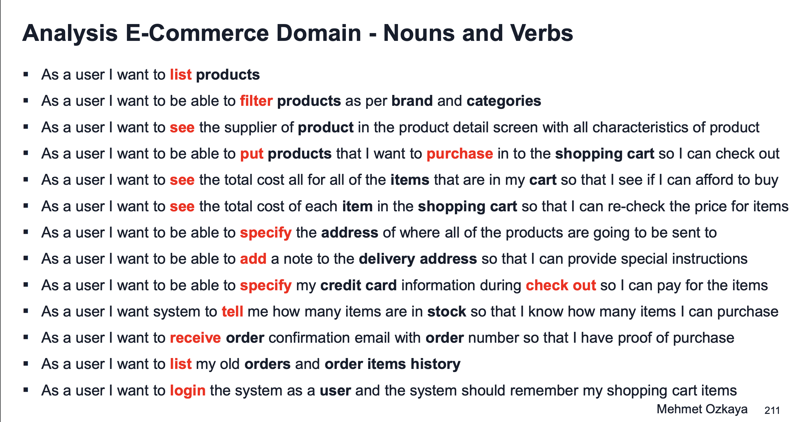
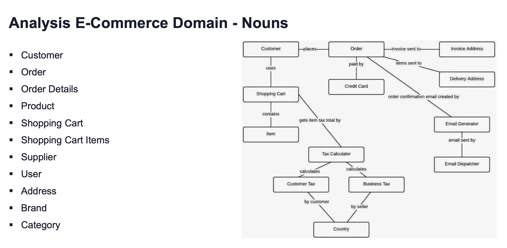
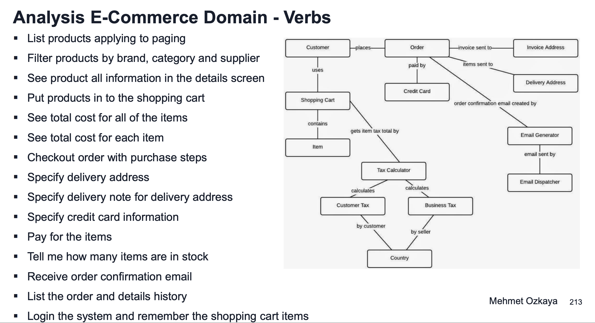
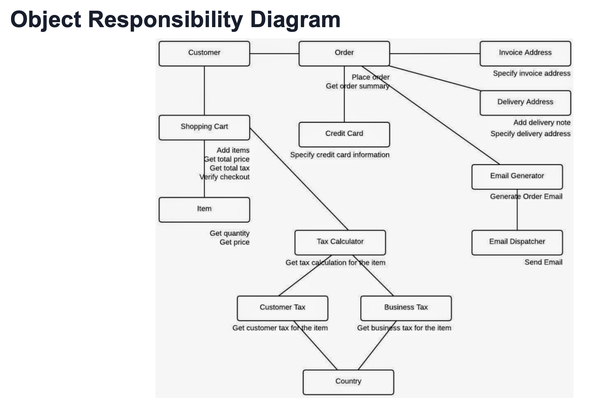
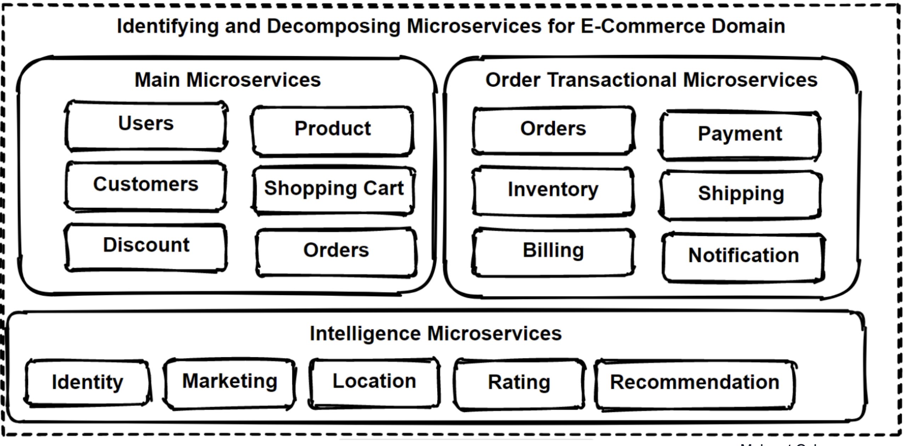

# Microservice Decomposition

- Domain Analysis
  - Define Boundaries
- DDD Bounded Contexts
- Decompose Strategies
- Identify boundaries of microservices

## Why decompose
 - Scale/Deploy independently 
   - Clearly define what needs this scaling

## Scaling Cube

The scaling cube, introduced by Martin Fowler, is a conceptual model used to analyze and plan the scalability of software systems. It involves three dimensions, often referred to as the "three axes of scalability":

 - X-Axis Scaling (Horizontal Duplication): Involves replicating the entire application horizontally, creating multiple instances of the same service behind a load balancer. This approach is suitable for stateless services and helps distribute the load evenly across instances.

 - Y-Axis Scaling (Functional Decomposition): Involves decomposing the application into separate services based on specific functional areas or features. Each service handles a subset of the application's functionality, allowing for independent scaling and optimization.

 - Z-Axis Scaling (Data Partitioning): Involves partitioning data across multiple instances or databases based on specific criteria, such as user ID or geographic location. This approach helps distribute the data workload and improve performance and scalability.

By considering these three axes of scalability, teams can design and implement scalable architectures that address different dimensions of scalability, ensuring the system can handle increased load and maintain performance as it grows.

- Microservices is an example of functional decomposing.
  - Combinign both X & Y-axis can give better scaling
  
## Decompose - By Business Functionality

- Split app into a set of loosely coupled services
- 2 Prereq's of decomposition of mss
  - Services must be cohesive
    - Should implement a small set of strongly related functions
  - Services must be loosely coupled
    - Each service as an api that encapsulates its implementation
- Services should be defined corresponding to business capabilities

## Decompose - By Subdomain

- In DDD the domain is the business and consists of multiple subdomains
  - Each subdomain corresponds to a different part of the business

## Bounded Context Pattern

- Main patter we use when dcomposing microservices
- Domains that require high cooperation are called colloborative domains
- DDD has 2 phases, Strategic & Tactical DDD
  - Strategic 
    - Define a large model of the system
    - Defining business rules that allow designing loosely coupled units & a context map between them. 
  - Tactical 
    - focus is on implementation and provides design patterns we can use to build software
  - Concepts used include
    - Entity, Aggregate, Value Object, Repository & Domain Service
- DDD domain defines its own common language & divides boundaries into specific, independant components. Common language is called ubiquitous language & independant units are called bounded context. 
- DDD is solving a complex problem by breaking the problem into smaller parts and focus on smaller problems that are relatively easy. 
- DDD divides large models into differant bounded contexts
  - Being explicit about their interraltionships
- Bounded context is the grouping of closely related scopes and their logical boundaries

# How to identify a BC

- Use DDD
  - use context mapping
    - context mapping lets us identify the whole bounded contexts in the app & their boundaries
  - Identify BC talking to domain experts
    - iterate design
  - evaluate BCs with domain experts to help identify microsvcs
  - Sub domains inside of the bounded context are represnting the same data but different names due to domain expert's area
- A bounded context can create more than 1 microservice
  - depends on technical need for scale/deploy independance

# Using domain analysis to model microservices

- MSvcs should be designed by business capabilities
- DDD provides a method to create msvcs
- Follow DDD-Bounded Context 
  - Context mapping pattern & decompose by sub domain models pattern

# Checklist after decomposing

- MSvc should do one thing
- MSvc size not too big or small
- Avoid very chatty comms
  - Maybe combine MSvcs that require too much comms
- No locking dependencies
  - Try to avoid situations where svcs require comms with many svcs and those svcs should all be deployed together for changes. 

# Learn Project Domain

- E-Commerce App
- understand Domain and Decompose
  - User Cases
  - Functional Req's

- Identify steps
  - Req's and modelling
  - Identify Users Stories
  - Identify Nouns in User Stories
  - Identify Verbs in User Stories

- FReq's
  - List Products
  - Filter 
  - Add to cart
  - apply coupon
  - checkout
  - list old orders

- Convert FReq's to user stories
  - As a user I want to list products, etc

- Lets pick the Nouns and Verbs from our User Stories above
  - list (verb)
  - products (noun)

- Nouns are domains
- Verbs are interactions

# Evaluate

## Problem 

- Clients are directly speaking to microservices
  - Very Chatty
  - Difficult to orchestrate for clients

## Solution

- Well defined API design
  - Microservices communication Patters ->>>
