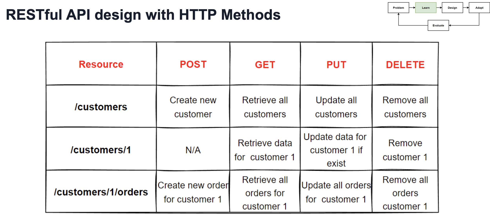
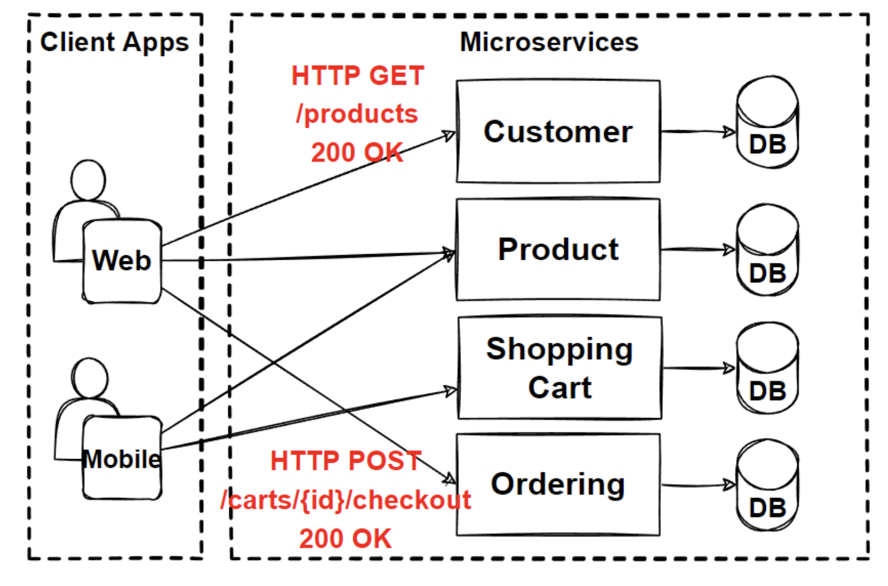
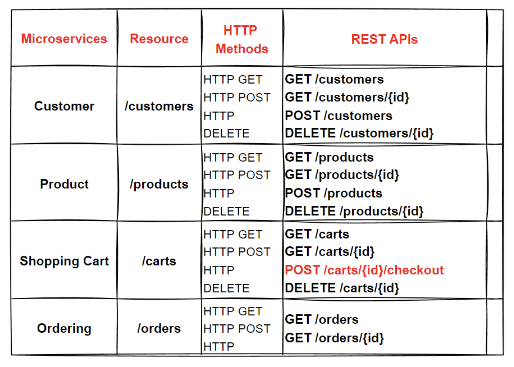
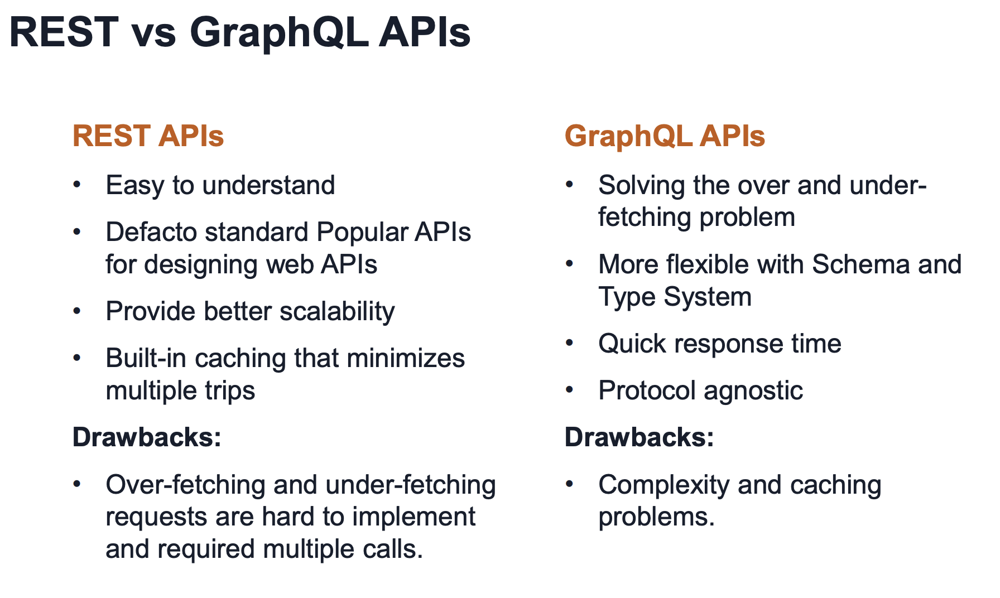
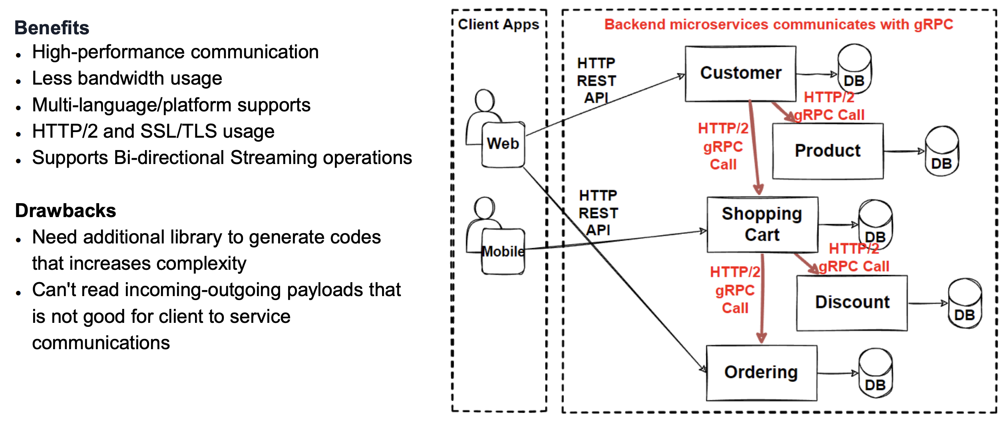

# Microservice Communication Patterns

- Sync vs Async
- RESTful API design
- GraphQL
  - flexible structured comms
- gRPC
  - High performance internal comms
- WebSocket
  - 2 way comms

# Problem 

 - Direct client to svc comms
   - Chatty clients
   - Hard to manage invocations from client app

# Solutions

- Well defined API Design
- Microservices Comm Patterns

# Steps
- Well defined Restful API design for svcs
- API Gateway
- BFF
- Pub/Sub

# MicroSvc Comms

- Challenge, inter-service comms
  - AMPQ, HTTP, gRPC
- Isolate business into microsvcs as much as possible
- Use async comms between internal svcs as much as possible
- Create well-defined APIs for inter-svc comms
- Monolith inter-process method alls beomce APIs in microsvcs
- Groups some ops and expose aggregated APIs that cover several calls from many sources
- Smart endpoints & dumb pipes
  - microsvcs should be loose couple and expose endpoints with restful apis in order to provide end-to-end use cases
- Sync vs Async
  - Sync 
    - Request/Response
  - Async
    - AMPQ

# Sync & Async Comms

## Sync

- Http or gRPC
  - Request/Response
  - Thread blocks while waiting

## Async

- Client doesn't block or wait for response
- AMQP KAFKA RABBITMQ
- Async Comms can be
  - one to one (queue model)
  - one to many (topic model)

- One to One
  - Single producer and single reciever
- One to Many
  - Multiple recievers
    - Each message can be processed by zero to multiple recievers
- Event bus or msg broker system is publishing events berween microsvcs & recievers subscribe in an async way
- Pub/Sub mechanism used in event driven microsvcs arch

## Request driven or Event driven 

- Request/response
  - http & rest
  - gRPC & GraphQL
- Push and real time
  - Websocket protocol
- Pull Communication
  - HTTP & AMPQ (short/long polling)
- Event driven comm
  - Publish/Subsribe model

### Req/Response

- For sync, use http & rest protocols
- Expose APIS using http & rest
  - REST uses HTTP verbs GET/POST/PUT/PATCH
- If comms are between microsvcs, use gRPC, high perf & low latency
- Use Graphql alt to REST APIS
  - GraphQL we can structure the requested response
    - efficiency

### Push/Pull Comms

- Push & real-time comms based on http/web socket protocol
- Build 2way comms such as chat apps and steaming dashboards with websocket apis
- Pull comm based on HTTP and AMPQ 
  - called polling and its basically like refreshing inbox each few mins
    - potential waste of bandwidth
    - open/close connections is expensive
    - doesnt scale well
    - apis like twitter will have limits on api calls
  
### Event driven with Pub/Sub

- Microservices don't call one another
  - Instead create events & consume from a message broker system
  - AMPQ, Kafka/Rabbit
  - Pub/Sub Pattern
  - Producer doesn't know about consumer services & vice versa
  - Services decoupled 
- No clear orchestrator
  - Increased complexity debugging and controlling flow

# Designing HTTP RESTful APIs for MSvcs

- For req/resp we should use REST when deigning APIs
- How?
  - Well defined API is important
  - Should be efficient and not chatty
  - Well documented and versioned
- 2 types of APIs for sync comm in msvcs
  - Public APIs
    - Use RESTful APIs over HTTP
      - JSON payloads
  - Backend APIs
    - Inter-service comms can result in a lot of network traffic
      - Serialization speed & payload speed more important
      - Using gRPC is mandatory for increase in network performance

# Compare REST to gPRC

- REST uses HTTP & req/resp as JSON object
- API interfacts design based on HTTP verbs like GET/PUT/POST/DELETE
- gRPC remote procedure call
  - invoke external system with binary network protocols
  - payloads unreadable but fast

# RESTful apis

- lightweight, extensible & simple 
- Representation State Transfer
  - Roy Fielding PhD in 2000
- REST allows apps to communicate with each other by carrying JSON data between client and serve

- REST characteristics
  - Stateless
  - Uniform Interface
  - Cacheable
  - Client-Server
  - Layered
  - Code on Demand

- RESTful systems 
  - comms over http 

- Richardson maturity Model
  - 0 one URI all ops are POST
  - 1 URI per resource
  - 2 HTTP methods to define operations on resource (GET/POST/DELETE)
  - 3 hypermedia (dynamic resource links in response)

- HTTP methods
  - GET
    - retrieve info
  - HEAD
    - retrieve resource header
  - POST
    - submit data to server
  - PUT
    - save an object at the location
  - DELETE
    - delete object at the location
  - PATCH
    - update single piece of data(partial update)

# Design RESTful API for single microservice

- Focus on business entities
  - organise resources in line with business entities and expose via APIs

client - HTTP GET /products (200 OK) > Product - DB

- rule 1 
  - resource URIs based on nouns
    - http://e-shop.com/products
- rule 2
  - every resource has an identifier
    - http://e-shop.com/products/4
- rule 3
  - rest apis use JSON
    - http://e-shop.com/products/4
    - {"productId": 4, "name": "iPhone"}
- rule 4
  - REST APIS perform operations on resource with HTTP Verbs

- A RESTful API design for E-Commerce App
  - Customer, Order, Product
  - How should we design api to get customer orders?
    - e-shop.com/customers/6/orders
  - I want products for order 22 for customer 6
    - e-shop.com/customers/6/orders/22/products , WRONG!
  - Complexity will become difficult to maintain
  - Keep URIs simple
    - Maximum Complexity should be;
      - "collection/item/collection"
    - Instead 
      - GET /customers/6/orders
      - GET /orders/22/products

- Microservices dont share code and dont share data stores
  - Comms through APIs for data operations. 
    - GET /api/customer/1
      - Fetch from DB
        - return JSON

# API Versioning in RESTful APIS

- API changes may break comms for calling services
- New features or bug fixes may require API changes
- API changes should be backward compatible
  - Do not break comms
- Use roll-out or canary deployments on k8s
- Use container orchestration to roll-back if there is a problem
- Microservices should support at least 2 versions and be backwards compatible

# Refactor our design

## RESTful Resources

# Evaluate

- Benefits
  - Simple from browsers
  - HTTP Protocol
  - HTTP GET easy caching options
  - JSON respresentation request-responses
- Drawbacks
    - Multiple requests needed for relational data
    - Chatty communication when enriching data

# Problem 

## N+1 problem

- Problems
  - Business teams want to see relational  data on screen. 
  - Customers , Oders, Products
  - REST: /customer/3/orders/4/products
  - How can we get products from order X for customer Y ?
  - Very chatty for enriching data
- Solutions
  - GraphQL API Design
  - Structural relational data with querying GraphQL

# Graphql

- Is a query & mutation language for APIs
- Client can define structure of data req'd
- Provides a complete desc of data in the API
- Provides many data sources in a single request
  - reducing the numer of network calls
- devs can ask for exactly what they need & get predictable results

- Evolve APIs without versions
  - Add new fields and types without impacting existing queries

## Schemas, Queries, Mutations & Resolvers

- A schema dscribes all possible data in the GQL API
  - Schema is made of objects which define the object, fields and data types
- Client sends queries, queries are validated against the schema & server executes valid queries 
- Resolvers are funcs that attach to fields in a schema
- Mutation is a gql op that allows insertion of new data or modify existing data. 

## GraphQL Pros & Cons

- Pros
  - Very fast in comparison to REST
    - Reduce multiple calls to get data & allows client to query by only specific fields
  - Single Request
    - No overfetching
  - Strongly Typed
    - Reduce  miscommunication between client/server
  - Hierarchical Structure
    - Relationships easy to define
  - Easy Evolution
    - API can get more fields and types without breaking existing queries
- Cons
  - Query complexity
  - Single query language
  - I is possible to request deeply nested data which may cause perf problems
    - Consider max query deptch, query complexity
  - Caching
    - More complicated to implement a simple cache because each query can be different
  - Graphql rate limiting more complicated

## REST v GraphQL

- REST is defacto standard
  - Inflexibile for rapidly changing requirements
- GraphQL was developed for more flexibility & efficiency that solves shortcomings of REST like n+1 relational data problem
- REST is popular, simple & scalable
- Graphql is more complex, main cons are error reporting, caching & n+1
- Graphql solves over/under-fetching problem
  - REST can't fetch relational data

# Problem

Inter-service comms heavy load on network

 - Public APIs should use HTTP
   - Restful or GraphQL 
 - Backend APIs should use inter-service comms
   - gRPC for network perf
     - serialization 

## gRPC

- google RPC remote procedure call
  - HTTP/2 protocol to transport binary msgs
  - Protocol Buggers Protobuf allow interface definition
  - Geenrates cross-platform client and server bindings
    - Tech agnostic
  - Most commonly used to communicate in microservices style architecture

- like a direct function call on remote system

- Benefits og gRPC
  - Using HTTP/2 
    - 30/40% perf
  - Bin serialization
  - Multi language support
  - Bi-directional streaming ops
  - SSL/TLS
  - Auth methods

- Use cases of gRPC
  - Sync backend microsvc to microsvc comms
  - Polyglot envs
  - low latecncy high thrughput comms
  - point to point real time comms
  - network constrained envs
    - payloads smaller than JSON

## gRPC use in microsvcs 

# WebSocket API

 - Interactive 2 way comms session
 - Send msg to server & recieves event based respoonses
 - Websockets good for handling high scale data transfers between server client
 - Bidirectional, ws://
 - WebSocket is stateful 
   - when client or server closes connection
   - it is terminated on both ends

- When to use
  - Real-time app development
    - Stock Trading Apps
    - Game Apps
    - Chat Apps

# Problem

- Direct Client to Service Comms
- Chatty Clients
  - Hard to manage invocations

# Solutions

- Well Defined API design
- Microservices Comm Patterns

# Steps

- API Gateway
- BFF(backend for frontend)
- Pub/Sub