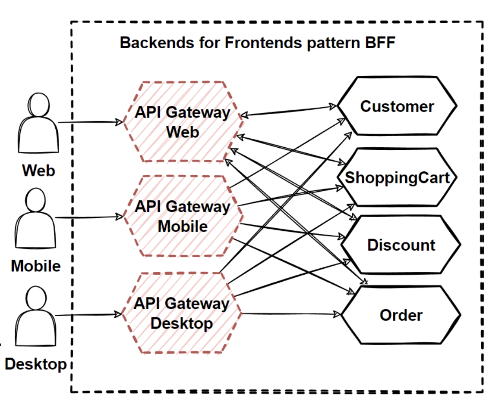
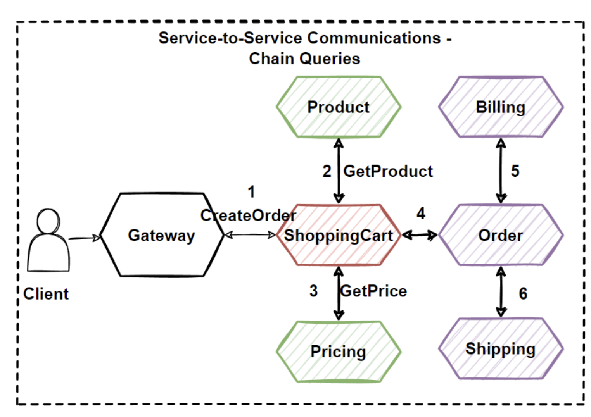
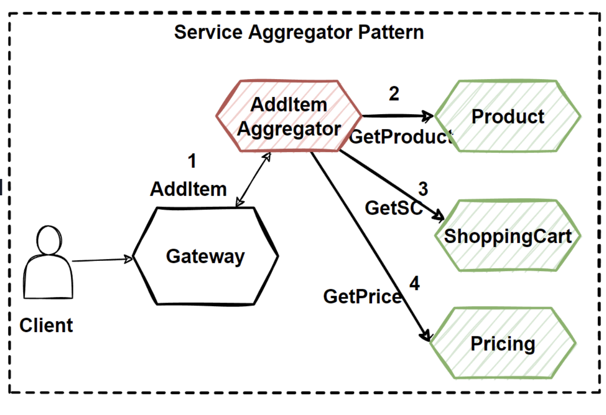
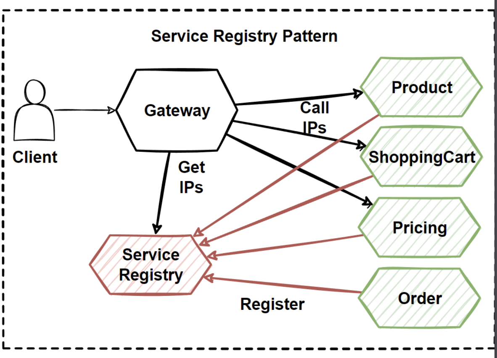

# MicroService Communication Patterns

- APII Gateway PAttern
- Gateway Routing Pattern
- Gateway Aggregation PAttern
- Gateway Offloading Pattern
- Backends for Frontend Pattern

## Problems

- Problems
  - Direct Client-to-Service Communication
  - Cause to chatty calls from client to service
  - Hard to manage invocations from client app with
  all different protocols (HTTP, GraphQL, gRPC,
  WebSocket)

- Solutions
   - Well-defined API Design
   - Microservices Communication Patterns
- Steps
  - Microservice Communications and Types
  - Well-defined RESTful API Design for services
  - Microservices Communication Patterns (API
  Gateway, BFF, Publish/Subscribe..)

  # API Gateway

  - Why
    - Manage client comms
    - Client code complexity, latency
    - Strong coupling between FE & BE
    - Cross-Cutting concerns
      - Authentication, Authorisation, Rate Limiting, SSL certifications, logging, monitoring, load balancing, circuit breaker
      - Difficult across multiple microservices
    - Protocol translation
      - If calls needed that require grpc + http etc
    - Async comms req's
      - Microservices may be using async comms to decouple comms

# Solution 

- Use API Gateway 
  - Single Point of Entry
  - Sits between clients and BE svcs
  - Can handle cross cutting concerns
    - LB, monitoring, logging, rate limits, protocol transalations, authentication, authorization

- Gateway Patterns
  - Routing pattern
  - Aggregation Pattern
  - Offloading Pattern

## Gateway Routing PAttern

- Single EP exposes multiple microservices
  - Decouples client from BE services
  - Client code can be kept simple
  - Blue/Green canary deployment easier
  - Use Application Layer 7 routing

## Aggregation Pattern

- Aggregate multiple requests to internal microservices, exposing a single request to clients
- Dispatch requests to multiple svcs & aggregate the results for client response
- Reduce network overhead

## Offloading Pattern

- Shared functionalities can be moved into centralized places
 - Authentication, Authorisation. SSL, Rate Limiting, Logging, Monitoring, Load Balancing
 - Cross cutting concerns for all microservices not a good idea
   - Increases deploy & maintenance complexity
 - Gateway offloading pattern offers to manage all those cross-cutting concerns into api gateways. 

 # Risk

  - Single API gateway could be a sinlge point of failure
    - Use BFF, backend for frontend pattern
      - Multiple API gateways per client

# Evaluate

- Benefits
  - Reverse Proxy, Aggregation, Routing
  - Abstraction of BE
  - X cutting concerns
  - Reduce chattiness
- Drawbacks
  - Single POF
  - Complexity in Gateway
  - Bottleneck

# Problem 

- Many different clients
  - Customer, Admin, Web, Mobile
- Each client may have different use cases and differnt calls & aggregations
- Clients may want different format data

# Solutions

- Client focused gateways
- BFF Backend for Frontend Pattern

# BFF

- Seperate API Gateway for each specific front end
  - Grouping by client type

 - Benefits
   - Client focused Interfaces
   - Minimal logic on the frontend code
   - Streamline data representation
   - Well-focused interface for the frontend
  client applications
 - Drawbacks
   - Increased Latency
   - Good for large-scaled microservices
  application which has several client
  applications

  # Service to Service comms 

  

- Problems
  - HTTP calls to multiple microservices
  - Chain Queries problem
    - latency, coupling, blocking
  - Visit more than a few microservices
  - Increased latency
- Solutions
  - Aggregate query operations
  - Service Aggregator Pattern

# Service Aggregator Pattern

Used to minimise svc to svc comms. 

- Service Aggregator Pattern receives a request
from the client or API Gateway.
  - Dispatches requests to multiple internal backend
microservices.
- Combines the results and responds back to the
initiating request in 1 response structure.
- Reduces chattiness and comms
between the client and microservices
- Isolates the underlying addItem operation that
makes calls to multiple back-end microservices.
- Centralizes logic

# Service Registry Pattern

 - To find network locations of microsvcs
   - a centralized registry provides register and discover functionality
 - Protocols
   - Client-side
   - Server-side
 - 3 participants
   - Registry, Client, Microservices
 - Function
   - Svcs register to registry
   - Registry keeps records of svcs
   - clients use registry to lookup svc locations

# Evaluate

- Benefits
  - Aggregator
    - Reduce Chattiness for client
    - Abstract operations that call multiple BE svcs
    - Centralizing logic into specialized microservice
  - Registry
    - Dynamic network discovery
      - No hardcoding or config in repos
    - Keep track of svc locations beforehand
- Drawbacks
  - Latency increased
  - Good for large scaled microsvcs with several client apps
  - Only for sync comms problems

# Adapt

## API Gateways

- Kong
- Tyk
- Express
- Amazon Gateway

## Registry
- Netflix Eureka
- Kubernetes
- Serverless

## BE Svcs
 - Java Spring Boot
 - .NET
 - Node JS

## Database
 - Mongo 
 - Redis
 - MySQL

# Problems - Sync comms

## Chained Queries

If Svc to Svc calls are http, it can become unmanageable
Sync messaging, req/resp can negatively affect latency & availability
What happens if a step fails?

## Solutions
- Use Async comm patterns
- Use Agg Pattern (Already seen)

