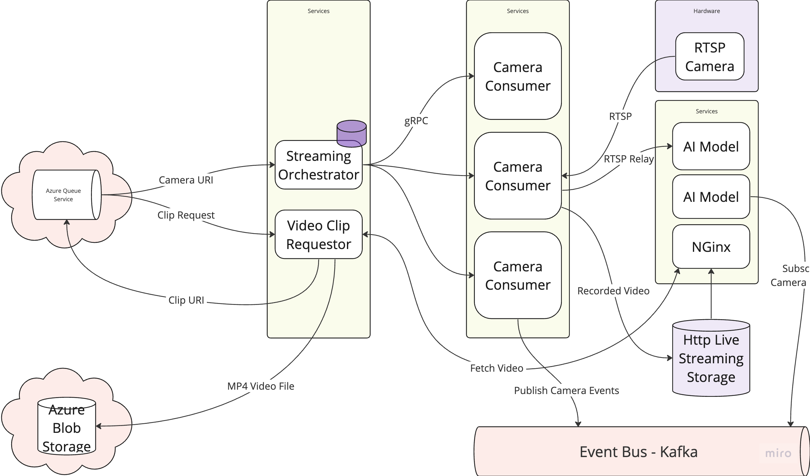

# Trading App Design

## Webhooks

- What is a webhook?
  - A webhook is a http callback that sends real-time event data to another service when an event occurs
- How do webhooks differ from APIs?
  - A webhook pushes automatically, whereas an API must be polled for updates
- When would you use a webhook over an API?
  - When you want real time updates & avoid overhead of polling
- How are webhooks typically implemented?
  - A client sends a http request with a callback URL to the webhook service, when events occurs the webhook service will HTTP post to the callback URL
- How do you secure webhooks?
  - OAuth tokens in HTTP Headers
  - Verify OAuth token via OAuth provider introspection endpoint
  - Create root cert, then server and client certs
    - COnfigure server to sign https/tls responses with server cert
    - Configure client to sign https/tls responses with client cert
      - Both servers use root cert to verify the messages 
  
## Kafka

- What is Apache Kafka?
  - Kafka is a distributed streaming platform used for building real-time data pipelines and streaming applications
- What are the main components of Kafka?
  - Producers, Consumers, Brokers, Topics, Partitions & Zookeeper
  - Producers write to a topic
  - Consumers subscribes to a topic 
  - Brokers are services in the cluster that store data and serve client requests
  - Topics is a named entity to which records are published and consumed
  - Consumer Group is a group of consumers that work together to process messages on the same topic
  - Zookeeper is used for managing & coordinating kafka brokers & facilitating leader election for partitions 
  - Kafka Offset, unique ID for records within a partition
    - Used by consumers to track how many messages they've read
  - Kafka Log Compaction is the process whereby kafka removes old records with the same key after a certain time
- What are Kafka Streams?
  - Used to build real time processing apps
  - A library for consuming, processing & producing kafka messages
  - Automatic management of offsets
  - Exactly once message delivery gaurantee
- What is the difference between Kafka and traditional messaging systems
  - Kafka offers higher throughput, scalability, durability, and fault-tolerance compared to many traditional messaging systems.
- How does Kafka handle fault tolerance?
  - Replicating data across partitions on multiple brokers
- How does Kafka handle message ordering?
  - Kafka gaurantees message ordering in a partition but not across partitions
- Kafka Connect API?
  - Kafka Connect can be configured to pull data from external sources and place it on kafka topics
  - It is typically deployed in the kafka cluster
- What is the purpose of Kafka Schema Registry?
  - To enforce a schema on messages
    - AVRO, JSON Schema, Protobuf
- How can you monitor Kafka?
  - Expose JMX metrics, read those with prometheus, visualise with grafana, alert via integrations like e-mail, slack, pagerduty. 

## RabbitMQ

- What is RabbitMQ?
  - AMQP Message Broker
- What is a message broker?
  - Intermediary software facilitating routing of messages between producer and consumer
- What is a queue in RabbitMQ?
  - A buffer that stores messages from producers to be prcoessed by consumers
- What is message acknowledgment in RabbitMQ?
  - Ack is a message to rabbitmq from a consumer, indicating it has been processed and can be removed from the queue
- What is message durability in RabbitMQ?
  - Published messages can be made persistent, so they are durable
- What is message routing in RabbitMQ?
  - Process of directing messages from producers to queues
- What is a binding in RabbitMQ?
  - Relationship between an exchange and a queue
- What is an exchange in RabbitMQ?
  - An exchange takes published messages and routes them to one or more queues based on routing rules
- What are the different types of exchanges in RabbitMQ?
  - Direct
    - Messages with routing key X sent to queue with binding key X
  - Fanout
    - Routes messages to all queues bound to the exchanges
  - Topic
    - Messages with routing key order.X sent to queue with pattern "order*"
  - Headers Exchange
    - Headers are matched to queue header bindings
- What is a dead-letter exchange (DLX) in RabbitMQ?
  - Where messages end up that could not be routed
- What is message TTL (Time-To-Live) in RabbitMQ?
  - Max time a message will live on a queue
- What is clustering in RabbitMQ?
  - Connecting multiple rabbit broker nodes together to act as a single logical broker 

## Databases

- What is MySQL?
  - Open source Relational Database, used Structured Query Language(SQL) to manage and manipulate databases
- What is a relational database?
  - A Relational Database stores data in tables and links tables via primary and foreign keys
    - Primary Key is a UID for a record in a table
    - Foreign Key is a link to a record in another table
- What is SQL
  - Language used to manipulate Databases
- What are the differences between SQL and NoSQL databases?
  - Relational DBs used structured schemas & tables, support ACID transactions and are ideal for complex queries and data integrity.
  - NoSQL DBs use flexible schemas, like key-value, document, graph, column
    - Designed to be horizontally scalable
    - Do no support ACID transactions
- What are indexes in MySQL?
  - Indexes are data structures that improve query performance
    - Primary Index: Ensures unique, non-null values; automatically created with primary key.
    - Unique Index: Ensures uniqueness; allows one NULL per column combination.
    Full-Text Index: Enables efficient text searches.
    Regular (Non-Unique) Index: Speeds up data access without enforcing uniqueness.
     - Composite Index: Indexes multiple columns together.
     - Spatial Index: Used for indexing spatial data types.
    Hash Index: Provides fast lookups for equality comparisons; available with MEMORY engine.
    - Descending Index: Optimizes queries that sort results in descending order.
    Functional Index: Indexes the values of a generated column.
- What are the ACID properties?
  - Atomicity, TX fails or succeeds entirely
  - Consistency, Ensures data integrity, follows DB rules
  - Isolation, concurrent tx do not interfere
  - Durabile, completed tx are saved
- What is normalization?
  - Reducing repetition in databases by splitting into multiple tables
- What is a JOIN in SQL?
  - SQL operation that combines rows from 2 or more tables based on related columns

| Join Type  | Description                                                      | Included Rows               |
|------------|------------------------------------------------------------------|-----------------------------|
| INNER JOIN | Rows with matching values in both tables                         | Matches only                |
| LEFT JOIN  | All rows from the left table, matched rows from the right table, NULL for non-matches | All left, matching right    |
| RIGHT JOIN | All rows from the right table, matched rows from the left table, NULL for non-matches | All right, matching left    |
| FULL JOIN  | All rows with matches in either table, NULL for non-matches      | All left and right          |

- How does replication work in MySQL?
  - Copies data from master to slave to support resiliency, load balancing
  - Can be async or sync
- What is sharding?
  - Sharding is the process of partitioning a database into smaller, more manageable pieces (shards) that can be distributed across multiple servers for scalability.

# Video Streaming Platform

## gRPC

- What is gRPC?
  - RPC lib uses http2 for transport and protobuf for serialization
- How does gRPC compare to REST?
  - gRPC uses HTTP2, utilisation of binary data, compressed headers and bi-directional comms
  - More efficient than REST, which is Text based, single message per connection, uses HTTP verbs to indicate intent
- What is protobuf?
  - Language agnostic serialization standard 
- gRPC main features?
  - Serialization, auth, remote procedure call, req/resp
- What are the different types of RPCs supported by gRPC?
  - Unary, Simple Request/Response
  - Unary RPC
  - Server Streaming RPC
  - Client Streaming RPC
  - Bi-directional Streaming RPC
- How does gRPC handle service definitions?
  - Defined in a .proto file using protobuf syntax
- What is the role of the .proto file in gRPC?
  - Defined the service methods, req and resp message formats
  - Used to generate client and server stubs in multiple languages
- How does gRPC handle authentication?
  - Supports SSL/TLS
  - Supports OAth2 integration
- What are the common use cases for gRPC?
  - Microservices comms
  - realtime data streaming
  - interprocess comms
- How does gRPC compare to GraphQL?
  - gRPC focus is high perf, strong typing and streaming support
  - GraphQL focus on flexible querying & schema evolution

# Search Catalogue

## GraphQL

- What is GraphQL?
  - A query language for apis and runtime for executing those queries
- Difference between REST & GraphQL
  - REST has fixed endpoints for each resource, GraphQL has a single endpoint and you ask for what you want
- What is a GraphQL schema?
  - A schema defines types & structure of data available via the api, incl. queries & mutations
- What is a GraphQL query?
  - A ready only operatation, requesting specific data 
- What is a GraphQL mutation?
  - Operation to modify data on the server
  - Similar to POST, PUT, PATCH, DELETE in REST
- What is a resolver in GraphQL?
  - A resolver is a definition in code to resolve a value for a type or field in the graphQL schema
- How does GraphQL handle versioning?
  - Typically, schema should evolve adding new fields and avoid breaking changes
  - If breaking changes are needed, it's possible to maintain old fields and communicate intent of deprecation to clients
- What are some benefits of using GraphQL?
  - Efficient fetching of data(avoid overfetch), strong typing, real-time updates, imroved developer experience
  - Ease of debugging API, via web UI in test envs
- What is introspection in GraphQL?
  - The API structure itself is qeuryable for types and fields
- How does GraphQL handle authentication and authorization?
  - Similar to REST, using SSL & OAuth
- 

## Opensearch

- What is Opensearch?
  - OpenSearch is a distributed search and analytics engine that enables users to perform real-time data analysis and visualization on large datasets.
- Relationship between Opensearch & Elasticsearch
  - OpenSearch is a community-driven fork of Elasticsearch and Kibana, created after Elasticsearch's parent company changed its licensing model. It offers the same core features and APIs as Elasticsearch.
- 
